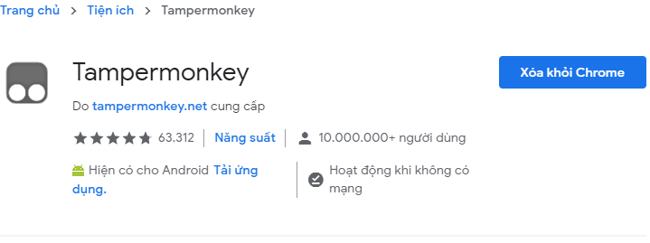
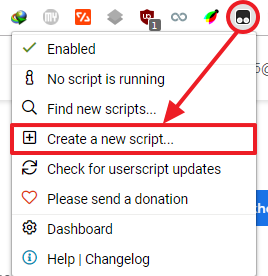
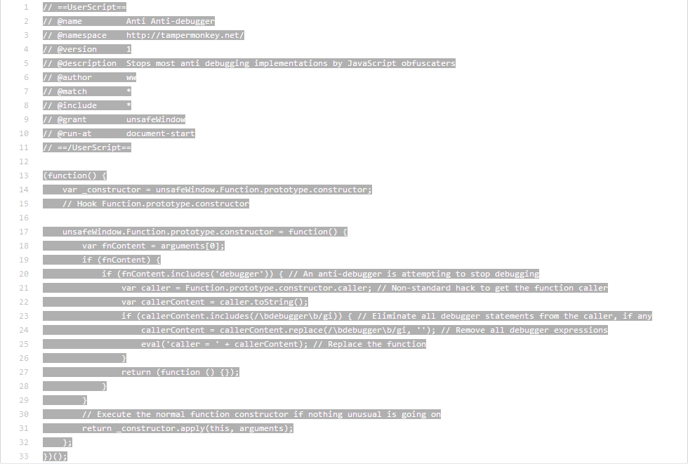
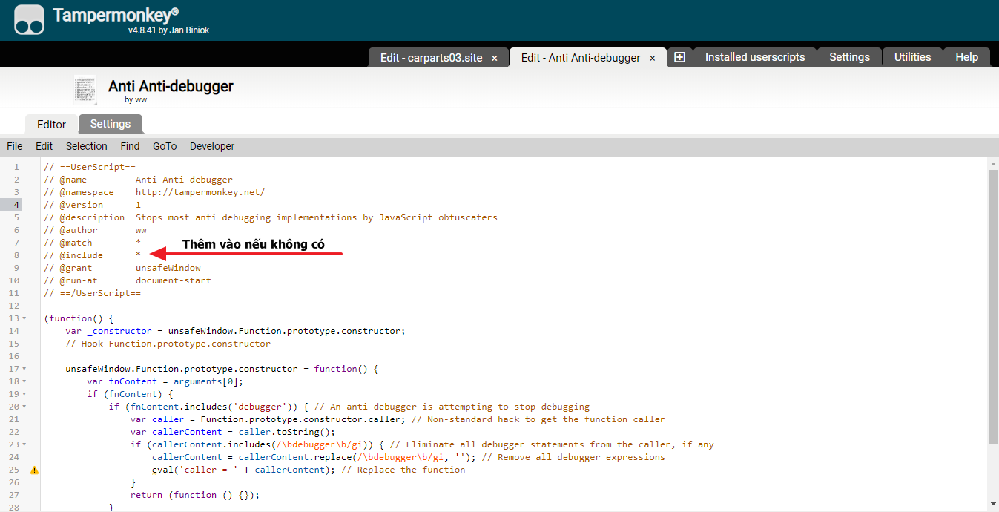
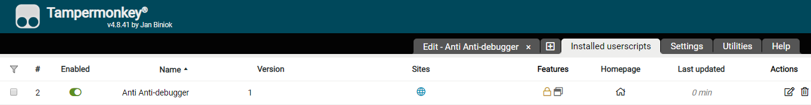

## Chống lại việc chống debug javascript trên Chrome

Trên chrome cài đặt Tampermokey extension tại [link](https://chrome.google.com/webstore/detail/tampermonkey/dhdgffkkebhmkfjojejmpbldmpobfkfo). 
 
Tại Tampermokey chọn ***Create a new script...***. 
 
Sao chép mã javascript [tại đây](https://greasyfork.org/vi/scripts/32015-anti-anti-debugger/code) vào Tampermokey hoặc bạn cũng có thể google: "*Anti Anti-debugger*"  
 
 
Gõ ***CTRL+S*** để lưu lại. Ta được:  
 
#### Vậy là xong.
