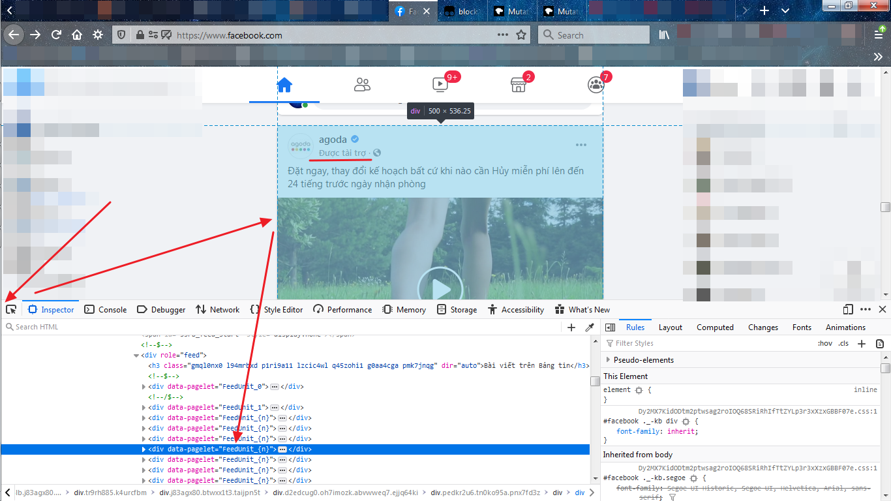
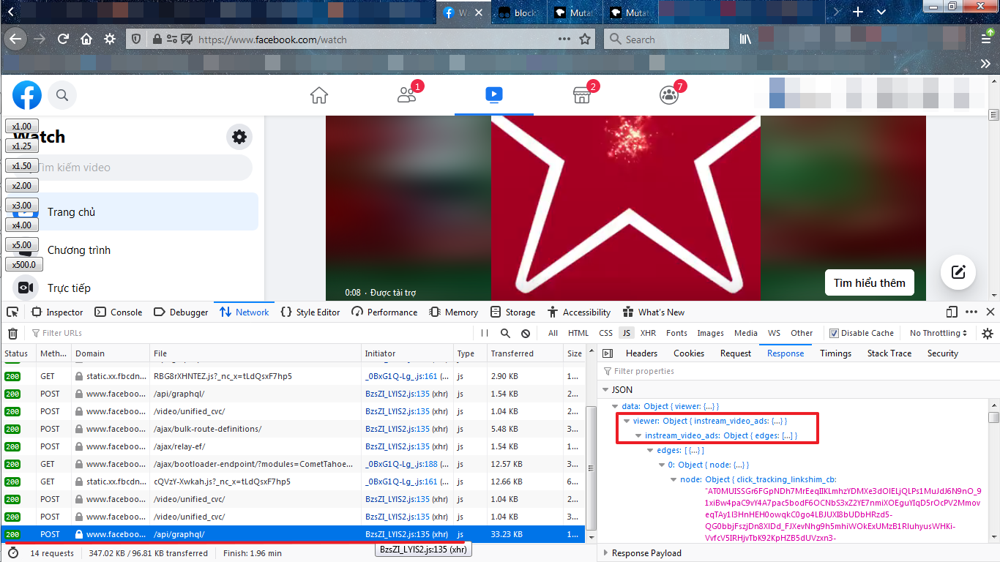
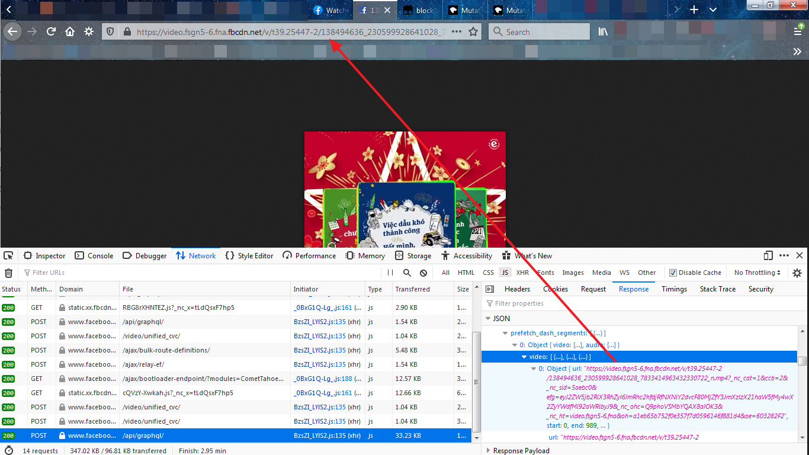

## Tổng quan
Ở bài viết này sẽ hướng dẫn chặn quảng cáo có trong facebook web. Để loại bỏ quảng cáo, chúng ta sẽ nhúng code javascript vào facebook web thông qua một số tiện ích trình duyệt như [tampermonkey](https://www.tampermonkey.net/), [violentmonkey](https://violentmonkey.github.io/), ...

Bài này sẽ chia làm 2 phần:
- Xóa quảng cáo dạng **Được tài trợ**
- Xóa quảng cáo trong video.

### 1. Xóa quảng cáo *Được tài trợ*
Đầu tiên chúng ta xác định xem nút nào sẽ chứa bài đăng. Dùng devtool và Inspector trỏ vào 1 bài đăng bất kỳ và dò ngược tới khi nào thấy danh sách các nút có thuộc tính giống nhau.



Hình trên mô tả  danh sách các nút chứa bài đăng của facebook web. Nút nào có thuộc tính data-pagelet thì nút đó có chứa bài đăng. 

Khi lướt facebook thì nội dung sẽ được thêm liên tục, tức là DOM sẽ thay đổi. Nên để nhận biết được điều này chúng ta sẽ sử dụng một api rất hay và phổ biến là [MutationObserver](https://developer.mozilla.org/en-US/docs/Web/API/MutationObserver).

Chúng ta sẽ dùng MutationObserver để giám sát cây DOM **document.body**, quan sát xem nút nào được thêm mới, lọc nút đó, nếu là quảng cáo thì xóa.

```
var mutationObserver = new MutationObserver(function(mutations) {
    mutations.forEach(function(mutation) {
        switch (mutation.type) {
            case "childList":
                processNode(mutation.target);
                return;
        }
    });
});

mutationObserver.observe(document.body, {
    attributes: false,
    characterData: false,
    childList: true,
    subtree: true,
    attributeOldValue: false,
    characterDataOldValue: false
});
```

Với hàm khởi tạo [MutationObserver](https://developer.mozilla.org/en-US/docs/Web/API/MutationObserver/MutationObserver) sẽ nhận tham số đầu là một callback. Tham số đầu của callback là một mảng các [MutationRecord](https://developer.mozilla.org/en-US/docs/Web/API/MutationRecord). Ở đây chúng ta sẽ quan tâm đến loại mutation là **childList**, tức là nút có các nút con mới được thêm vào.

Sau đó ta dùng phương thức [observe](https://developer.mozilla.org/en-US/docs/Web/API/MutationObserver/observe) để quan sát đối tượng **document.body**. Khi cây con hoặc nút con thay đổi thì sẽ bắn tín hiệu đến callback để xử lý các nút này.

Tiếp theo, chúng ta sẽ viết hàm xử lý quảng cáo.

```
function processNode(node){
    if (node && node.getAttribute("role") === "feed" ){
        let childrens = node.children;
        for(let i = childrens.length-1; i >= 0; --i){
            if(childrens[i].getAttribute("scanned")) break;
            if(childrens[i].getAttribute("data-pagelet")){
                if (childrens[i].textContent.substr(0, 512).indexOf("Được tài trợ") > -1){
                    childrens[i].remove();
                }else{
                    childrens[i].setAttribute("scanned", "true");
                }
            }
        }
    }
}
```

Với hàm trên chúng ta sẽ lọc, nếu nút tồn tại và có thuộc tính ***role == feed*** thì đúng là nút chúng ta cần tìm. Vì nút này là nút cha của các nút có chứa bài đăng bao gồm cả quảng cáo (Xem hình đầu).

Sau đó chúng ta duyệt các nút con từ đít đến đầu vì các nút con mới sẽ được facebook thêm vào đít trước tiên ^-^. Để phân biệt được đâu là quảng cáo thì chúng ta sẽ lọc những nút có nội dung có dòng chữ **Được tài trợ** sau đó xóa bỏ nút đó. Ngược lại chúng ta sẽ đánh dấu những nút mà chúng ta đã duyệt qua để tránh duyệt lại gây lãng phí tài nguyên.

Vậy là xong ^-^.

### 2. Xóa quảng cáo trong video.
Xác định nguyên nhân gây ra quảng cáo. Trong lúc xem video chúng ta sẽ bật devtool lên, sang thẻ Network để xem request. Để video chạy tới lúc quảng cáo xuất hiện rồi dừng video. Lúc này chúng ta sẽ mò từng request xem có gì đặt biệt không.



Sau một hồi mò mẫm, chúng ta phát hiện điều hay ho. Các bạn để ý là trong phần nội dung trả về của url ***https://www.facebook.com/api/graphql/*** có chữ **ad** chứ. Không biết các bạn có hiểu chữ này không, chứ với tôi thì thấy chữ này là điều vui mừng không thể tả. Vì có chữ này là gần như đánh dấu rằng nội dung có chứa quảng cáo. Để chắc chắn nó chứa quảng cáo tôi sẽ lội xuống phần nội dung bên dưới, mời các bạn xem ảnh sau.



Tôi sao chép cái url trên vào trình duyệt thì nó ra cái nội dung video quảng cáo có trong video mà tôi vừa xem. Suy ra đúng là con hàng này rồi.

Ok, biết chắc chắn là nó rồi, vậy bây giờ làm sao chặn đây. Xem xét url và dò sang cột Initiator thì chúng ta thấy dòng chữ **xhr** chứ. Vậy là url này được gọi bởi [XHR - XMLHttpRequest](https://developer.mozilla.org/en-US/docs/Web/API/XMLHttpRequest). Vậy có cách nào thay đổi nội dung trả về không ? Tất nhiên là có chứ. 

Chúng ta sẽ tạo một lớp gọi là ProxyXHR đại diện cho XMLHttpRequest.

```
var oldXMLHttpRequest = unsafeWindow.XMLHttpRequest;
function ProxyXHR() {
	var _xmlHttpRequest = new oldXMLHttpRequest();
	var _self = this;
	function proxy(name) {
		try {
			if ((typeof _xmlHttpRequest[name]) == 'function') {
				_self[name] = function() {
					return _xmlHttpRequest[name].apply(_xmlHttpRequest, arguments);
				};
			} else {
			    let property = {};
			    if (name === "responseText"){
			        property.get = function() {
			            // Block ads in videos
			            let responseText = _xmlHttpRequest.responseText;
			            if (_xmlHttpRequest.responseURL.indexOf("https://www.facebook.com/api/graphql") > -1 &&
			                responseText && responseText.substr(0, 100).indexOf("video_ad") > -1){
			                return "{}";
			            }
			            return responseText;
			        }
			    } else {
			        property.get = function() { return _xmlHttpRequest[name]; }
			    }
			    property.set = function(value) { _xmlHttpRequest[name] = value; }
				Object.defineProperty(_self, name, property);
			}
		}
		catch (e) {}
	}

	// FIX onreadystatechange is not enumerable [Opera]
	proxy('onreadystatechange');

	for (let n in _xmlHttpRequest){
        if (n === "onreadystatechange") continue;
		proxy(n);
    }
}
```

Để thay đổi nội dung trả về chúng ta sẽ xử lý thuộc tính [responseText](https://developer.mozilla.org/en-US/docs/Web/API/XMLHttpRequest/responseText) của XMLHttpRequest. Vì thông thường người ta hay dùng **JSON.parse** đi kèm với **responseText** để trả về Json object sau đó xử lý nó trong javascript.

Với code trên chúng ta sẽ kiểm tra xem có đúng là url ***https://www.facebook.com/api/graphql*** và có chứa nội dung ***video_ad*** không ? Nếu đúng trả về chuỗi json rỗng. Code js của facebook sẽ dùng JSON.parse(xhr.responseText) để lấy Json object, vì json rỗng nên object không có giá trị => không có quảng cáo trong video.

Tuy nhiên với code trên là chưa đủ, chúng ta phải thêm 1 đoạn code ma thuật vào thì mới hiệu quả ^.^

```
unsafeWindow.XMLHttpRequest = ProxyXHR;
``` 

Đến đây là xong phần này.

### Cài mã chặn quảng cáo.
Sau khi các bạn cài tampermonkey hoặc violentmonkey, các bạn vào link [này](https://greasyfork.org/en/scripts/420550-remove-ads-fb) để sử dụng code chặn quảng cáo facebook nhé.

## HẾT