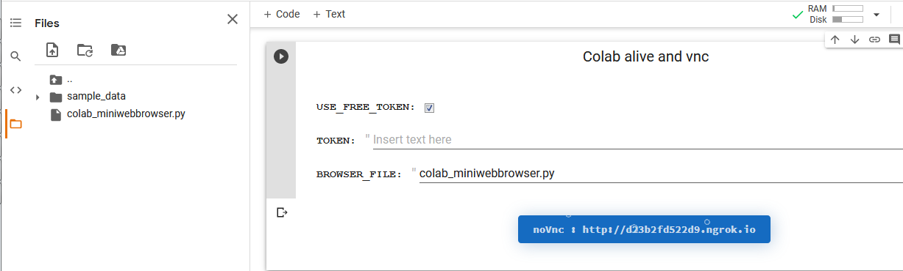
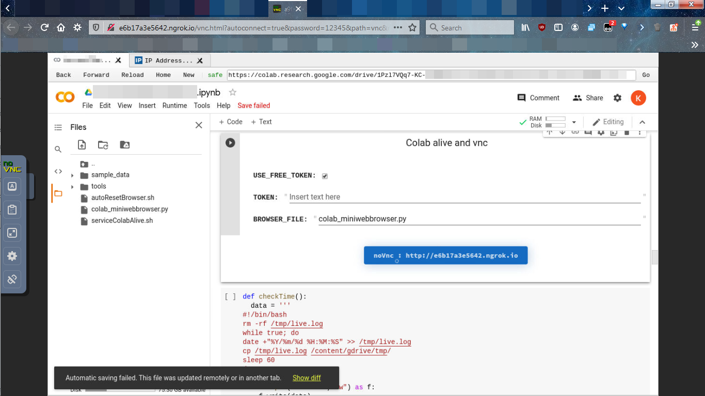

## Tổng quan
Ở [bài viết](https://nhtcntt.blogspot.com/2020/12/keo-dai-su-song-cho-google-colab.html) hôm trước, chúng ta đã tạo ra một trình duyệt web mini để chạy colab. Tuy là tạo và chạy được nhưng bây giờ chạy nó ở đâu ? Với một số ae dư giả sẽ chạy nó trên vps windows hoặc chạy ngay trên máy tính của mình, nhưng đối với tui, tui cho nó chạy trên colab luôn ^.^ Đó cũng nguyên nhân sinh ra bài viết này.

Như ae đã biết mỗi khi chạy một dự án trên google colab thì sẽ được cung cấp một máy ảo chạy môi trường dòng lệnh gnu/linux. Nhưng với trình duyệt web của chúng ta muốn nó chạy phải cung cấp môi trường đồ họa. Mà đồ họa thì cần màn hình, mà màn hình đâu ra ^v^. Tất nhiên là màn hình thật không có thì ta dùng màn hình ảo chứ sao nữa.

### Tạo màn hình ảo.
Để tạo được màn hình ảo, chúng ta sẽ cần đến anh bạn Xvfb. [Xvfb (X virtual framebuffer)](https://www.x.org/releases/X11R7.7/doc/man/man1/Xvfb.1.xhtml) là một máy chủ X (X server) có thể chạy trên các máy mà không có màn hình. Nó mô phỏng một bộ đệm khung hình (framebuffer) sử dụng bộ nhớ ảo. Còn [X server](https://en.wikipedia.org/wiki/X_Window_System) là một hệ thống cửa sổ hiển thị bitmap, nó cung cấp một khung cơ bản cho môi trường đồ họa (GUI-graphical user interface). Tóm lại dùng xvfb sẽ có môi trường đồ họa ^_^ mà méo cần màn hình thực.

#### Cài đặt và chạy thử.
Để cài đặt trên colab ta dùng lệnh `!apt install xvfb`

Để tạo một màn hình ảo ta dùng lệnh `Xvfb :displaynumber -br -nolisten tcp -screen screennum WxHxD`. Giải thích: 
* **:displaynumber** Hiểu đơn giản là giống như workspace hoặc virtual desktop ấy. Còn chi tiết các bạn có thể tham khảo link [này](https://www.x.org/releases/X11R7.7/doc/man/man7/X.7.xhtml) phần DISPLAY NAMES
* **screennum** để dễ hiểu thì nó là màn hình máy tính (monitor) có thể chứa nhiều display (desktop ảo) bên trong và có số đo ba vòng là chiều rộng, chiều cao và chiều sâu.
* **-br** Đặt cửa sổ gốc là màu đen, tức là màn hình nền màu đen á.
* **-nolisten tcp** không lắng nghe trên tcpip vì chúng ta chỉ cần chạy trên local, tắt tcpip để giảm rủi ro bị tấn công thôi.

Về phần display và screen nó có hơi rắc rối, các bạn có thể tham khảo thêm link [này](https://unix.stackexchange.com/questions/503806/what-are-x-server-display-and-screen/503884) để hiểu thêm.
 
Để chạy trình duyệt web của chúng ta với cái màn hình ảo trên thì chúng ta phải thiết đặt biến môi trường **DISPLAY** với giá trị là **displaynumber**, tức là báo cho trình duyệt web biết nội dung sẽ được hiển thị ở đâu.

Ví dụ, ta tạo một màn hình (screen) ảo 0 có màn hiển thị (display) ảo (desktop ảo) là 99, đồng thời chạy trình duyệt web.
```
Xvfb :99 -br -nolisten tcp -screen 0 1280x720x24
export DISPLAY=99
python3 colab_miniwebbrowser.py
hoặc
DISPLAY=99 python3 colab_miniwebbrowser.py
```

Giải thích dài dòng vậy thôi chứ code có 3 dòng à ^v^. À với ae nào dùng docker thì cũng tương tự nhé ! 

Dùng linux cũng hay ho phết bên windows làm gì có vụ này ^.^

### Triển khai code lên colab.
Code phần này các bạn có thể xem [tại đây](https://gist.github.com/NguyenKhong/f0ccf17f3c1c031aba7a1f3d3f0e7c62).

#### Phân tích code
```
USE_FREE_TOKEN = True # @param {type:"boolean"}
TOKEN = ""  # @param {type:"string"}
BROWSER_FILE = "colab_miniwebbrowser.py" # @param {type:"string"}
```

* USE_FREE_TOKEN dùng hay không dùng token miễn phí của ngork. Nếu không dùng vui lòng thiết đặt biến TOKEN ngork của riêng bạn.
* BROWSER_FILE đường dẫn đến tập tin code trình duyệt mini

Trong code các bạn sẽ thấy hàm **serviceColabAlive** hàm này tạo ra tập tin serviceColabAlive.sh. Tập tin này nhiệm vụ chạy Xvfb và trình duyệt mini của chúng ta, đồng thời đảm bảo 2 thằng trên luôn chạy.

Với hàm **autoResetBrowser** sẽ tạo tập tin autoResetBrowser.sh nhiệm vụ reset lại trình duyệt sau mỗi 1 tiếng.

Phần code từ dòng 71 trở đi là phần code cài đặt vnc server ([x11vnc](https://github.com/LibVNC/x11vnc)), vnc client ([easy_novnc](https://github.com/geek1011/easy-novnc)) và [ngork](https://ngrok.com). Ngork giúp chuyển lưu lượng mạng từ internet về local cho vnc client, vì chúng ta không thể mở port cũng như biết IP công khai của máy ảo google colab. Phần code này chủ yếu để kiểm tra xem trình duyệt mini của chúng ta có chạy hay không thôi.

Đây là thành quả khi remote qua vnc.




Kiểm tra thực tế thì chạy được khoảng 11 tiếng, thời gian này cũng xem là đủ nhiều để ae có thể làm vài thứ khác chạy torrent, chuyển tập tin giữa các cloud, crack mật khẩu... ^.^

## HẾT

 


