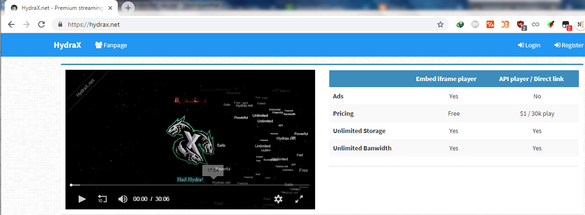
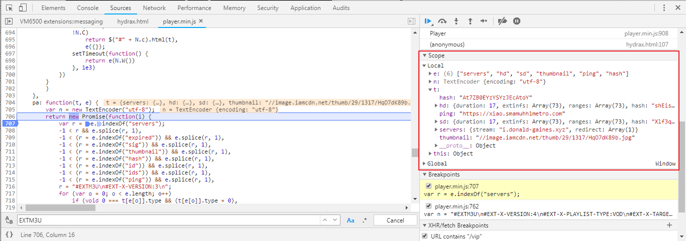
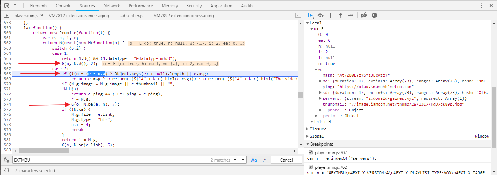
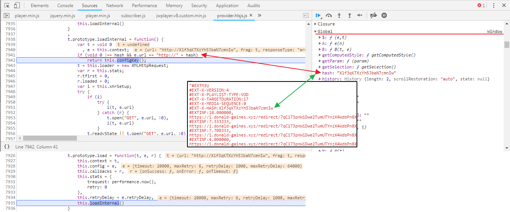
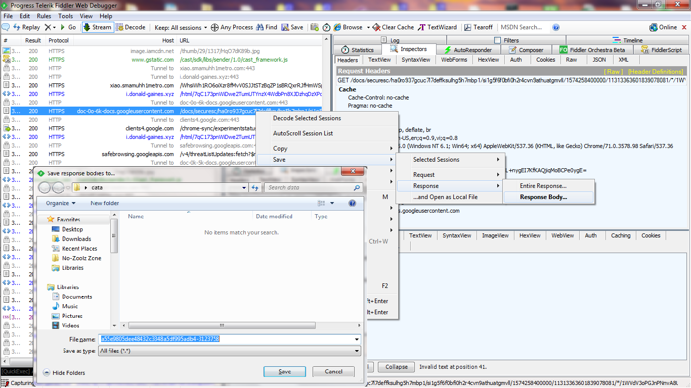

## Các trang web xem phim đã sử dụng google drive như thế nào ?
Trước khi đọc bài viết này, các bạn nên đọc bài viết [*Làm thế nào mà trang web có thể phát video*](https://nhtcntt.blogspot.com/2019/11/lam-nao-ma-trang-web-co-phat-video.html) trước để có kiến thức cơ bản, giúp hiểu hơn bài viết này.

### Phụ lục
1. Giao thức HLS là gì ?
2. Khám phá.
3. Họ đã sử dụng google drive để lưu phim ra sao ?
4. Làm sao tải được HLS ?

### 1. Giao thức HLS là gì ?
**HTTP Live streaming (HLS)** là một giao thức truyền dẫn (transport protocol) nội dung media, nó dựa trên HTTP. Được phát triển bởi **Apple**.

Tập tin **manifest** của HLS là **playlist** có định dạng **M3U8** (Phiên bản hỗ trợ Unicode của M3U dùng mã UTF-8).

Đặc tả kĩ thuật của HLS các bạn có thể tìm hiểu [tại đây](https://tools.ietf.org/html/rfc8216)

### HLS hoạt động như thế nào ?
Sau đây là mô hình hoạt động đơn giản của HLS.
<p align="center"></p>

Giải thích
1. Từ nguồn đầu vào (Media source) như là tập tin MP4, MKV, máy quay phim, điện thoại, ... Chúng được đưa đến máy chủ (server) để lưu trữ, xử lý.
2. Tại máy chủ, chúng được mã hóa (encode) thành chuẩn MPEG-2 TS, thường dùng các phần mềm như ffmpeg, mp42hls để chuyển đổi. Đầu ra là các tập tin **Playlist** và các tập tin **TS**.

	Với tập tin **Master Playlist** chúng sẽ chứa đường dẫn tới các tập tin **Media Playlist**, kèm với chất lượng từng loại media (cao, thấp, trung bình, HD, 480p, ...)
	```
	#EXTM3U
	#EXT-X-STREAM-INF:BANDWIDTH=150000,RESOLUTION=416x234,CODECS="avc1.42e00a,mp4a.40.2"
	http://example.com/low/index.m3u8
	#EXT-X-STREAM-INF:BANDWIDTH=240000,RESOLUTION=416x234,CODECS="avc1.42e00a,mp4a.40.2"
	http://example.com/lo_mid/index.m3u8
	#EXT-X-STREAM-INF:BANDWIDTH=440000,RESOLUTION=416x234,CODECS="avc1.42e00a,mp4a.40.2"
	http://example.com/hi_mid/index.m3u8
	#EXT-X-STREAM-INF:BANDWIDTH=640000,RESOLUTION=640x360,CODECS="avc1.42e00a,mp4a.40.2"
	http://example.com/high/index.m3u8
	#EXT-X-STREAM-INF:BANDWIDTH=64000,CODECS="mp4a.40.5"
	http://example.com/audio/index.m3u8
	``` 
	
	Còn tập tin **Media Playlist** sẽ chứa thông về các tập tin **phân đoạn TS**.
	```
	#EXTM3U
	#EXT-X-PLAYLIST-TYPE:VOD
	#EXT-X-TARGETDURATION:10
	#EXT-X-VERSION:4
	#EXT-X-MEDIA-SEQUENCE:0
	#EXT-X-KEY:METHOD=AES-128,URI="https://example.com/key.php"
	#EXTINF:10.0,
	http://example.com/movie1/fileSequenceA.ts
	#EXTINF:10.0,
	http://example.com/movie1/fileSequenceB.ts
	#EXTINF:10.0,
	http://example.com/movie1/fileSequenceC.ts
	#EXTINF:9.0,
	http://example.com/movie1/fileSequenceD.ts
	#EXT-X-ENDLIST
	```
	Sau đây là giải thích một vài thẻ có trong ví dụ trên:
	* **EXT-X-PLAYLIST-TYPE**: có 2 loại là VOD (Video on Demand - video theo yêu cầu) và EVENT. 
	* **EXT-X-TARGETDURATION**: thời gian tối đa mà từng phân đoạn video có thể đạt được.
	* **EXT-X-VERSION**: Phiên bản của tập tin **Playlist**
	* **EXT-X-MEDIA-SEQUENCE**: Số thứ tự của url xuất hiện đầu tiên trong playlist này.
	* **EXT-X-KEY**: *Tùy chọn*. Thẻ này xuất hiện khi bạn muốn bảo vệ nội dung media. Nó chỉ ra **phương thức mã hóa**, kèm theo đường dẫn đến **chìa khóa (key)** giải mã của từng **tập tin TS**.
	* **EXTINF**: Chỉ ra đường dẫn đến từng phân đoạn media, kèm với một số nguyên hoặc số thực cho biết thời gian diễn ra của từng phân đoạn tương ứng. Thời gian này phải <= EXT-X-TARGETDURATION 
	
	Có khi bạn cũng gặp phải loại Media Playlist này nữa
	```
	#EXTM3U
	#EXT-X-PLAYLIST-TYPE:VOD
	#EXT-X-TARGETDURATION:10
	#EXT-X-VERSION:4
	#EXT-X-MEDIA-SEQUENCE:0
	#EXT-X-KEY:METHOD=AES-128,URI="https://example.com/key.php"
	#EXTINF:10.0,
	#EXT-X-BYTERANGE:326744@0
	http://example.com/movie1/main.ts
	#EXTINF:10.0,
	#EXT-X-BYTERANGE:326368@326744
	http://example.com/movie1/main.ts
	#EXT-X-ENDLIST
	```
	Với loại này thì không chia ra nhiều tập tin TS nữa mà chỉ còn duy nhất 1 tập tin.

	Từ phiên bản 4 trở đi có hỗ trợ thêm thẻ **EXT-X-BYTERANGE** thẻ này cho phép request theo HTTP header Range đối với các máy chủ có hỗ trợ (cho phép tải nhiều mảnh, giống IDM ấy). 
	
	**EXT-X-BYTERANGE: n[@o]**, với **n** là một số nguyên chỉ ra độ dài của phân đoạn này tính bằng byte. Nếu có thêm **o** cũng là một số nguyên thì nó chỉ ra vị trí byte thứ bao nhiêu tính từ đầu tập tin gốc.
3. Sau khi được phân phối qua mạng bằng HTTP, thì trình chơi media (media player) như [HLS.js](https://github.com/video-dev/hls.js/) sẽ **phân tích nội dung Playlist**, tải các tập tin TS rồi phát lên web. Cơ bản là vậy.

#### Thông tin thêm.
Đối với các tập tin TS không bị mã hóa, các bạn có thể dùng **VLC** hoặc **Media Player Classic** có trong **K-Lite Codec Pack** để xem.

Để chuyển đổi tập các tập tin TS thành tập tin mp4 ta làm như sau
* Tải phần mềm ffmpeg [tại đây](https://www.ffmpeg.org/download.html).
* Đặt các tập tin ts vào cùng 1 thư mục chứa ffmpeg.
* Tạo tập tin **concat.txt** (tùy tên gì cũng được), với nội dung mẫu sau.
	```
	file 'segment_1.ts'
	file 'segment_2.ts'
	file 'segment_3.ts'
	file 'segment_4.ts'
	```
* Mở cmd hoặc powershell, terminal ở thư mục hiện tại rồi chạy lệnh sau
	```
	ffmpeg -f concat -i concat.txt -c copy -bsf:a aac_adtstoasc output.mp4
	```
* Cuối cùng nếu không lỗi thì bạn sẽ thu được tập tin **output.mp4** ở thư mục hiện tại.

### 2. Khám phá.
Trước khi xem nội dung tiếp theo, vui lòng đọc các bài này trước:
* [https://nhtcntt.blogspot.com/2017/06/mo-phong-http-request-fiddler.html](https://nhtcntt.blogspot.com/2017/06/mo-phong-http-request-fiddler.html)
* [https://nhtcntt.blogspot.com/2017/06/mo-phong-http-request-web-browser.html](https://nhtcntt.blogspot.com/2017/06/mo-phong-http-request-web-browser.html)
* [https://nhtcntt.blogspot.com/2019/10/thay-oi-noi-dung-http-response-voi.html](https://nhtcntt.blogspot.com/2019/10/thay-oi-noi-dung-http-response-voi.html)
* [https://nhtcntt.blogspot.com/2019/10/chong-lai-viec-chong-debug-javascript.html](https://nhtcntt.blogspot.com/2019/10/chong-lai-viec-chong-debug-javascript.html)

Chúng ta sẽ xem xét trang web mẫu [https://hydrax.net/](https://hydrax.net/), sử dụng Chrome và Fiddler.
1. Mở Chrome rồi bật Chrome Dev Tool và Fiddler, truy cập trang web [https://hydrax.net/](https://hydrax.net/).<p align="center"></p>
2. Cho chạy trình phát media một chút rồi ngừng.
3. Như đã đề cập ở phần trước, khi chúng ta xem video thì, trình chơi media sẽ tải tập tin Playlist và các tập tin TS. Chúng ta sẽ vào Fiddler xem xét thử.<p align="center"></p>
4. Sau một hồi tìm kiếm, chắc chắn các bạn sẽ chả thấy tập tin TS đâu cả. Nhưng không sao tôi sẽ chỉ cho các bạn cách nhận diện nó. 

	Các tập tin này sẽ có đặc điểm sau:
	* Thông thường một phần đường dẫn của URL sẽ lặp đi lặp lại.
	* Dung lượng các tập tin này khá cao từ vài trăm KByte đến MByte.
	* Đôi khi có trường **Range** trong HTTP header.
	* Và vì tiêu đề bài viết nên các bạn có thể suy ra nó được tải từ google về ^-^.
5. Chắc tới đây thì các bạn đã biết trong hình trên thì URL nào là URL chứa tập tin TS rồi nhỉ.
6. Như đã đề cập ở trên nếu không bị mã hóa các bạn thể dùng VLC để xem tập tin TS. Để kiểm tra nội dung TS có bị mã hóa hay không ta sẽ dùng VLC xem thử. 

	Chúng ta trích xuất nội dung TS ra Desktop rồi dùng VLC xem thử.
	

	Vì không xem được nên chúng ta kết luận ***nội dung TS đã bị mã hóa***.
7. Để xem URL này được gọi từ đâu, chúng ta thử tìm kiếm trong Fiddler trước. Nếu may mắn nó nằm trong tập tin nào đó, thì việc tải về sẽ dễ dàng hơn.

	Để tìm kiếm ta cần xác định URL, thông thường ta chỉ cần một phần của URL là đủ. Sau khi xác định chúng ta có phần url này: `/docs/securesc` vì nó có mặt hầu hết trong các URL chứa nội dung TS.
	<p align="center"></p>
	
	Không may là chả có dòng Highlight màu vàng nào hiện lên cả. Suy ra URL này có thể được sinh ra từ mã JS.
8. Quay lại **Chrome**, vào thẻ **Network**, tìm URL vừa nãy. Xem xét cột **Initiator** chúng ta sẽ biết URL này được gọi từ đâu.<p align="center"></p>
9. Qua thẻ **Sources**, chúng ta sẽ đặt một **XHR/fetch Breakpoints**. Chúng ta sẽ xác định phần nào trong URL trên không thay đổi và đặt breakpoint với phần đó.

	Sau khi xác định chúng ta có phần url này: `/docs/securesc`. Đặt breakpoint thôi.
	<p align="center"></p>
10. Tải lại trang. Chúng ta sẽ bị dừng ở điểm đặt breakpoint, trước khi gửi XHR/fetch request.<p align="center"></p>
11. Sau khi bấm nút `{ }` để làm đẹp code chúng ta được như sau.<p align="center"></p>

	> Mẹo: Để tránh tình trạng sau khi tải lại trang thì bị lag, do trình duyệt tự động làm đẹp code. Chúng ta sẽ sử dụng tính năng thay đổi nội dung http response ở bài gợi ý phía trên. Cụ thể, chúng ta sẽ copy đoạn code đã làm đẹp lưu nó vào đâu đó. Sau đó tìm URL tương ứng với tập tin trên (ở đây là provider.hlsjs.js) thay bằng nội dung mới (code đã được làm đẹp). Thế là xong khỏi lag. À nhớ đặt lại breakpoint nhé (XHR/fetch thì khỏi cần).

	> Bạn thấy tập tin tên provider.hlsjs.js chứ mã nguồn gốc của nó bạn có thể xem tại đây [hlsjs](https://github.com/video-dev/hls.js/)

 12. Chưa vội nhìn vào code mà ta hãy nhìn cột bên phải **Call Stack**, cột này sẽ cho ta biết hàm nào gọi hàm nào, hàm dưới cùng sẽ là hàm đầu tiên khởi tạo chuỗi Call Stack này.<br>
 
		Chúng ta sẽ đi dạo một lượt các hàm thử. Nhấp chuột vào từng hàm và xem xét code (mất khá nhiều thời gian).

13. Đến hàm thứ 3 từ trên xuống bạn sẽ thấy có vài điểm đáng nghi ngờ. Đặt breakpoint rồi tải lại trang chứ chờ gì nữa.
	<p align="center"></p>
	
	Sau một hồi debug thì có vẻ URL `googleusercontent.com/docs/…` bắt đầu từ URL `https://i.michel-clevenger.xyz/html/...`
	<p align="center"></p>
	
	Với hình trên thì bạn sẽ thấy biến **e.url** ban đầu có chuỗi `redirect` bị thay thành `html` và gán vào biến **n** => **n** chứa URL để request sau này.
	
	Vào Fiddler tìm URL trên và coi nội dung nó trả về là gì
	<p align="center"></p>

	Nó trả về Json trong đó có url bị base64, giải ra thì được URL `googleusercontent.com/docs/…`. Vậy là giải quyết được 1 cái.
	
14. Như đã phân tích ở trên, thay vì tìm URL `https://i.michel-clevenger.xyz/html/...` thì ta phải tìm URL `https://i.michel-clevenger.xyz/redirect/...`. Quay lai Fiddler và làm như bước 7. 

	Ở đây chúng ta sẽ tìm `i.michel-clevenger.xyz`.
	<p align="center"></p>
	
	May mắn là ta đã tìm được. Có vẻ response này rất quan trọng, nó chứa khá nhiều thông tin, nhưng hiện tại không hiểu nhiều về nội dung của nó.

15. Đến được bước này chúng ta sẽ có 2 lựa chọn debug:
	* Đặt XHR/fetch breakpoints với phần URL `/vip`
	* Đặt breakpoint với tại hàm **e.onManifestLoading**. Tại sao lại là hàm này? Bạn nhớ cuộc dạo chơi qua các hàm ở bước 12 chứ và bạn đã đọc bài *Làm thế nào mà trang web có thể phát video* rồi chứ, bạn sẽ thấy có một chứ rất quen thuộc **Manifest**, nó chính là **Playlist** đó. Có playlist mới có thể phát video.
16. Để việc debug dễ hiểu hơn, chúng ta sẽ đi debug hàm **e.onManifestLoading** trước.

	Về cơ bản thì hàm onManifestLoading của provider.hlsjs.js sẽ giống code của hls.js, bạn có thể tham khảo [tại đây](https://github.com/video-dev/hls.js/blob/master/src/loader/playlist-loader.ts#L131)
	
	Sau khi đặt breakpoint và tải lại trang chúng ta có.
	<p align="center"></p>
	
	Bạn thấy url chứ nó bắt đầu bằng chữ **blob** chứ! Nếu thấy url xuất hiện chữ này thì nó được tạo ra bởi phương thức **URL.createObjectURL**, nếu không biết hoặc không nhớ thì bạn có thể đọc lại bài viết *Làm thế nào mà trang web có thể phát video*  hoặc tra google nhá.

	Vậy chúng ta có thể xem nội dung trả về của url này không? Tất nhiên là xem được. Chúng ta chuyển qua thẻ **Network** nào.
	<p align="center"></p>
	Hình trên có nội dung của tập tin Master playlist. Vậy còn Media playlist thì sao !
	
	Để có được nội dung Media Playlist ta đặt breakpoint tại hàm **onLevelLoading** (ngay bên dưới luôn đó)
	<p align="center"></p>
	
	Quay lại thẻ **Network**.
	<p align="center"></p>

	Đến đây thì mọi thông tin về nội dung các phân đoạn TS đều hiện ra đầy đủ. Ta thử request một URL trong số các URL trên xem như thế nào.
	 Sau khi thử mở trên trình duyệt ta được kết quả như vầy.
	<p align="center"></p>

	Vậy tại sao URL kia lại request được ta, các bạn sẽ cho rằng nó thay `redirect` bằng `html` rồi mới request được tác giả ạ. Nhưng không các bạn vào Fiddler và làm theo như vầy coi.
	<p align="center"></p>

	Nội dung nó trả về nè
	<p align="center"></p>

	Ủa tại sao lại được. Tất cả là do trong HTTP header có trường **Origin: https://hydrax.net**. Trường này được đặt bởi nhà phát triển web tránh các trang web khác ăn cắp nội dung.

	Nếu các bạn thắc mắc ở bước 6 chúng ta nói nội dung TS bị mã hóa mà trong Media Playlist chả có thẻ **EXT-X-KEY** nào cả. Vấn đề này sẽ được giải quyết trong các bước sau.
	
	Tổng kết lại chút, chúng ta đã biết URL của TS, xem được nội dung Playlist, nhưng vẫn còn một vài vấn đề: Nội dung của Playlist được tạo ra như thế nào, làm thế nào giải mã nội dung TS.
17. Cách nội dung Playlist được tạo ra. Với phần này thì não chúng ta sẽ hơi nóng một chút vì hầu hết code đã được rút gọn nên sẽ hơi khó đọc.
	
	Để phần này đễ thở hơn một chút chúng ta sẽ tổng hợp thông tin, tìm kiếm, đặt breakpoint cho phù hợp.
	* Chúng ta biết URL **https://multi.idocdn.com/vip** có nội dung liên quan đến Playlist rồi phải không. Nên chúng ta sẽ đặt XHR/fetch breakpoint tại **/vip**.
	* Dựa vào kiến thức ở phần 1 chúng ta biết một Playlist sẽ có các thẻ như **EXTM3U** chẳng hạn, chúng ta sẽ thử tìm kiếm nếu có thì chúng ta sẽ đặt breakpoint tại đây.
	* Ở bước 16 chúng ta đã biết có url chứa blob, nên chúng ta sẽ tìm kiếm thử phương thức **URL.createObjectURL**. Nếu có chúng ta cũng sẽ đặt breakpoint luôn.
	
	Trước hết chúng ta đặt XHR/fetch breakpoint tại **/vip**. Sau đó tải lại trang.
	<p align="center"></p>

	Chúng ta sẽ dừng tại **player.min.js**
	<p align="center"></p>

	Chưa vội đọc code, chúng ta sẽ tìm kiếm **EXTM3U** và **URL.createObjectURL**. Nếu có thì đặt breakpoint.
	<p align="center"></p>
	
	<p align="center"></p>

	May mắn là chúng ta tìm được 2 vị trí có chứa **EXTM3U** và **URL.createObjectURL** cùng nằm trong 1 hàm luôn.

	Quay lại XHR/fetch breakpoint ban đầu
	<p align="center"></p>
	
	Chúng ta sẽ debug với 3 nút: 1 nút ô màu xanh, 2 nút ô màu đỏ (nút ô màu xanh cho phép nhảy đến breakpoint tiếp theo. Nút mũi tên xuống ô màu đỏ là đi vào hàm, ngược lại là đi ra khỏi hàm.)
	
	Chúng ta đang dừng ở API **fetch** một API cho phép tạo HTTP(S) request trả về một promise. Chúng ta nhìn thấy sau khi phân tích json xong, nó sẽ được gọi đến một hàm **e(t)** gì đó.
	<p align="center"></p>
	 
	Bạn sử dụng 2 nút mũi tên xuống, lên đi vào hàm e(t), não bạn sẽ bắt đầu nóng lên và kêu gì mà tùm lum vậy. 

	Không lẽ tới đây bỏ cuộc, không bạn thử bấm nút play trong ô màu xanh thử xem.
	<p align="center"></p>

	Ồ nó dừng lại ngay điểm ta mới đặt breakpoint kìa, và tham số **t** giống tham số **t** ở bức hình trên chưa kìa. Tuy nhiên 2 hàm này khác nhau nhá.

	Nhưng 2 hàm nó liên quan như thế nào với nhau. Tất cả là nhờ hàm **la**
	<p align="center"></p>

	Trong hàm **la** code trong **case 1** được thực thi trước, nó sẽ gọi hàm **G(o, N.W(), 2)**, mà **N.W()** là cái hàm có chứa api **fetch** lúc nãy đó, còn kết quả trả về sẽ lưu vào **o.w**.

	 Sau đó nó sẽ gọi tiếp **case 2**, gán **e = o.w**, sau đó gọi hàm **G(o, N.pa(e, n), 7)** vì vậy tham số **t** của hàm **pa** bên trên sẽ là **e** nên ta có kết quả như hình trên.
	
	Quay lại hàm **pa** chúng ta đi qua từng lệnh và dừng lại tại vòng **for**, lúc này **e.length = 2** và có giá trị là **sd** và **hd**. Vậy là nó có liên quan gì đó đến chất lượng HD và SD nè.
	<p align="center"></p>

	Quan sát thấy biến **r = "#EXTM3U\n#EXT-X-VERSION:3\n";** vậy là chúng ta đoán: nội dung trả về của url `https://multi.idocdn.com/vip` sẽ được dùng để xây dựng lại **Playlist** rồi mới đưa cho trình phát media (ở đây là jwplayer) phát lên web.

	Đi tiếp vào hàm **N.ua(e[o])** chúng ta sẽ có kết quả.
	<p align="center"></p>

	Vậy thì ra nó đang xây dựng lại **MasterPlaylist**.
	
	Đi tiếp vào hàm **N.fa(t[e[o]], t.servers)** nào.
	<p align="center"></p>

	Hàm này sẽ xây dựng lại **MediaPlaylist** tương ứng với mỗi loại chất lượng khác nhau.
	<p align="center"></p>

	Sau khi xây dựng xong MediaPlaylist nó sẽ trả về một **blob url** chứa nội dung của MediaPlaylist. Việc phân tích và xây dựng lại như thế nào mình xin không đề cập ở đây, vì nó sẽ làm bài viết này rất là dài. Tuy nhiên nó cũng khá dễ thôi.

	Quay trở lại hàm **pa**. Sau khi duyệt qua hết tất cả các chất lượng chúng ta thu được MasterPlaylist
	<p align="center"></p>

	Đoạn code trong ô hình chữ nhật đỏ được viết lại là
	```
	arg = [{
			file: URL.createObjectURL(new Blob([n.encode(r)],{
			    type: "application/x-mpegURL"
			})),
			type: "hls"
		}]
	return resolve(arg);
	```
	Nếu bạn đã từng sử dụng jwplayer thì sẽ thấy cấu trúc rất quen. Biến arg trên sẽ tham số của jwplayer.setup()
	```
	jwplayer.setup({
	        playlist:[{
	            sources: [{
	                file: url,
	                type: "mimeType"
	            }]
	        }]
	    });
	```
	Tổng kết, qua bước này chúng ta đã biết từ nội dung trả về của URL `https://multi.idocdn.com/vip` xây dựng ra được MasterPlaylist và MediaPlaylist rồi phải không, nhưng ta vẫn chưa giải quyết được vấn đề giải mã tập tin TS. Bước sau sẽ giải quyết vấn đề này.
	
18. Tìm cách giải mã nội dung TS. Vì phần này khá là khó nếu không có kiến thức từ trước, nên tôi sẽ chỉ bạn đặt breakpoint tại hàm nào luôn.

	Chúng ta sẽ đặt breakpoint tại hàm **onKeyLoading** thuộc provider.hlsjs.js, thấy tên hàm là biết nó làm gì rồi phải không. Mã gốc các bạn có thể tham khảo [tại đây](https://github.com/video-dev/hls.js/blob/master/src/loader/key-loader.ts#L42).
	<p align="center"></p>

	Sau khi tải lại trang chúng ta được như sau
	<p align="center"></p>

	Theo như hình trên thì nội dung TS được mã hóa **AES-128-CBC**, có **uri** để lấy **key** giải mã, và cả **IV** nữa. Vậy những thông tin trên ở đâu mà ra trong khi nội dung **MediaPlaylist** không có. 
	
	Nhìn lại hình và Call stack chúng ta sẽ thấy tham số hàm **onKeyLoading** là **t** hàm này được gọi bởi **_loadFragmentOrKey**.
	<p align="center"></p>
	Chúng ta không quan tâm các hàm trong ô màu xanh, chúng chỉ là các hàm phân phối và gọi sự kiện.
	
	Vì hàm **_loadFragmentOrKey** được gọi bởi hàm **_fetchPayloadOrEos** nên ta xem xét hàm này, trong hàm này biến **c = r.initSegment;**, mà biến **c** chính là tham số **t** của hàm **_loadFragmentOrKey**. Biến **c** bắt nguồn từ **r** nên ta chú ý đến tham số **r**
	<p align="center"></p>

	Mà hàm **_fetchPayloadOrEos** được gọi từ **_doTickIdle**, nên ta vào hàm **_doTickIdle** để xem xét.
	<p align="center"></p>

	Với hình trên thì **this.levels** ở đâu ra. Đúng hơn ta nên chú ý **this.levels[n].details** được tạo ra ở đâu.
	
	Bạn sẽ vào hai hàm là **_doTickIdle** và **doTick** bạn sẽ không thấy **this.levels**. Nhưng đến hàm **onLevelLoaded** thì lại thấy nó (hiện tại chúng ta đang ở **class e** nên **this** ở các hàm này đều cùng là một).
	<p align="center"></p>

	Và ở hàm **onLevelLoaded** ta biết rằng **this.levels[n].details** có liên quan đến tham số **t** của hàm này.

	Tiếp tục lội ngược lên hàm **_handlePlaylistLoaded**, chúng ta sẽ thấy **t.details** liên quan đến **i**.
	<p align="center"></p>

	Mà **_handlePlaylistLoaded** được gọi bởi **_handleTrackOrLevelPlaylist** nên ta vào xem xét tiếp.
	<p align="center"></p>

	Đặt breakpoint tại **k.parseLevelPlaylist(t.data, c, h, f);** và tải lại trang.
	<p align="center"></p>

	Tiếp tục đi vào hàm **parseLevelPlaylist**, ta xem xét chút.
	<p align="center"></p>
	Tới đây thì mọi thứ đã quá rõ ràng.

19. Tìm key giải mã. Từ thông tin bước trên chúng ta đã biết được IV, thuật toán mã hóa AES-128-CBC, url đến chỗ chứa key, và giờ chỉ còn thiếu key nữa thôi.

	Quay lại hàm **onKeyLoading**, chúng ta tiếp tục debug.
	<p align="center"></p>

	Tiếp tục và hàm **load**, hàm load sẽ gọi **loadInternal**. Bạn có thể tham khảo hàm load và loadInternal [tại đây](https://github.com/video-dev/hls.js/blob/master/src/utils/xhr-loader.js#L34). Tuy nhiên ở code sau đây thì nó đã được chỉnh sửa lại hơi khác một chút. 
	<p align="center"></p>

	Và **hash** là một biến toàn cục có giá trị bằng với giá trị của thẻ **EXT-X-HASH**.

	Tiếp tục đi vào hàm **configKey**.
	<p align="center"></p>

	Lúc này biến **t** dòng 8048 sẽ chứa giá trị của key giải mã (AES-128 bit = 16 bytes độ dài key), biến **t** được chuyển hóa từ biến **hash** thông qua hàm đơn giản ở dòng 8040. Thật ra decode base64 **hash** là ra được key rồi.

	Tổng kết vậy là ta đã có đủ thông tin để giải mã ròi.
 20. Giải mã nội dung TS. Bạn có thể dùng OpenSSL để giải mã từng tập tin TS.

		Ví dụ:
		* hash = **Xlf3qKTXzYh5JbaN7cmnIw** decode ra được hex: **0x5E57F7A8A4D7CD887925B68DEDC9A723**.<p align="center"></p>

		* Trích xuất tập tin TS.<p align="center"></p>

		* **IV = 0x0** hoặc dùng iv mà bạn kiếm được.
		
		Ta sẽ dùng lệnh sau để giải mã:
		```
		openssl aes-128-cbc -d -nosalt -iv IV(mã hex) -K key(mã hex) -in segment.ts -out seg_decrypt.ts
		```
		Với ví dụ trên ta sẽ có:
		<p align="center"></p>

		Và được kết quả:
		<p align="center"></p>
 ### 3. Họ đã sử dụng google drive để lưu phim ra sao ?
#### Trên máy chủ.
Như đã mô tả ở đầu bài viết, họ có lẽ đã dùng ffmpeg để tạo ra tập tin Playlist và tập tin TS. 

Khi tạo bằng ffmpeg bạn sẽ có 2 lựa chọn:
* Tạo nhiều tập tin TS, ví dụ: segment_1.ts, segment_2.ts, segment_3.ts, ...
* Tạo một tập tin TS duy nhất, cùng với thẻ **EXT-X-BYTERANGE** có trong **MediaPlaylist**. Với google drive nó có hỗ trợ byte range nên có thể dùng lựa chọn này.

Tạo được tập tin TS, họ sẽ tải nó lên google drive, lúc này sẽ có ID của tập tin TS đó. Có được ID họ dùng google drive api lấy link tải về tập tin TS từ ID đó, nhìn chung các link sẽ có dạng `.googleusercontent.com/docs/securesc/`. 

Tất nhiên từ link tải trên vẫn có thể truy ngược lại ID được. ví dụ: <b><i>https://doc-0o-6k-docs.googleusercontent.com/docs/securesc/ha0ro937gcuc7l7deffksulhg5h7mbp1/si1g5f6f0bfi0h2r4cvn9athuatgmvll/1574258400000/11313363601839078081/*/1WVdV3oPGJnPNnvA8UjRUNz0DtKJAoTLp?e=download</b></i> thì ID của nó là  **1WVdV3oPGJnPNnvA8UjRUNz0DtKJAoTLp**

Sau khi tạo xong **playlist** và key mã hóa, họ sẽ phân tích playlist chuyển nó thành dạng json giống như nội dung trả về của URL `https://multi.idocdn.com/vip`.

#### Tại trình duyệt web.
Họ tùy biến lại jwplayer mà cụ thể là *provider.hlsjs.js*. Sau đó gọi đến URL `https://multi.idocdn.com/vip` lấy nội dung về, xây dựng lại MasterPlaylist và MediaPlaylist, chuẩn bị key giải mã. Sau đó đưa cho jwplayer phát lên web.

### 4. Làm sao tải được HLS ?
Để tải được HLS các bạn có thể dùng một số phần mềm sau:
* [ffmpeg](https://www.ffmpeg.org/download.html): Thằng này đủ chức năng, mỗi tội tải HLS (m3u8) chỉ tải có một luồng duy nhất, thêm HTTP header hơi khó khăn, có thể bị mất frame (khung hình).
* [youtube-dl](https://github.com/ytdl-org/youtube-dl/tree/master): Hỗ trợ tốt, tuy nhiên vẫn tải một luồng, mặc định nó dùng ffmpeg để tải, để bỏ qua việc này ta dùng tùy chọn **--hls-prefer-native**, lúc này tự chính nó sẽ tải. Có hỗ trợ tự viết phần mở rộng cho từng host khác nhau, tham khảo [tại đây](https://github.com/ytdl-org/youtube-dl/tree/master#developer-instructions). Được viết bằng Python, hỗ trợ 2 và 3.
* [streamlink](https://github.com/streamlink/streamlink): Hỗ trợ tốt, có tải đa luồng, phát trực tiếp lên VLC được luôn, lưu vào tập tin hoặc chơi cả 2 cùng lúc. Có hỗ trợ viết phần mở rộng gọi là **plugins**, nhưng không thấy hướng dẫn viết. Tuy nhiên bạn vẫn có thể viết tự được, có thể tham khảo code [tại đây](https://github.com/streamlink/streamlink/tree/master/src/streamlink/plugins). Được viết bằng Python3.

Muốn tải được video từ các trang web trên thì các bạn có thể dùng các phần mềm trên. Kèm với đó là lấy nội dung từ URL `https://multi.idocdn.com/vip` (URL ví dụ, mỗi web mỗi khác), xây dựng lại **Playlist**. Trích xuất key giải mã nếu có, thêm nó vào **MediaPlaylist** với thẻ **EXT-X-KEY**. Rồi mới đưa cho các phần mềm trên tải về.

## HẾT


	
	


	
	 

