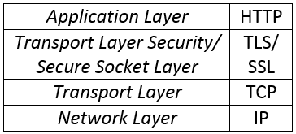

## HTTP(S) proxy server hoạt động như thế nào ?
### Phụ lục
1. Giao thức HTTP. 
2. Giao thức HTTPS.
3. HTTP(S) proxy server hoạt động như thế nào ?
4. Một số vấn đề gặp phải khi dùng HTTPS proxy server như Fiddler, Burpsuite.
5. Mã nguồn proxy server tham khảo.
### 1. Giao thức HTTP.
*HTTP (Hyper Text Transfer Protocol - Giao thức truyền tải siêu văn bản)* là một giao thức của mạng Internet, được dùng để trao đổi thông tin giữa máy cung cấp dịch vụ web (web server) và máy sử dụng dịch vụ web (web client) trong mô hình mạng Client/Server dùng cho WWW (World Wide Web). 

HTTP là giao thức thuộc tầng ứng dụng (Application Layer), nằm trên tầng giao vận (Transport Layer) và tầng mạng (Network Layer). 
<p align="center">

</p>

#### Vậy để HTTP hoạt động thì cần gì ? <br>
HTTP thuộc mô hình TCP/IP, mô hình này hoạt động theo tầng, vì vậy để xử lý dữ liệu của HTTP, thì ta phải thỏa mãn các điều kiện của các giao thức ở tầng dưới nó thì mới có thể hoạt động được, cụ thể ở đây ta phải thỏa mãn  TCP và IP (không xem xét các giao thức bên dưới IP vì được máy tính và card mạng xử lý rồi.). 
* Cơ bản thì giao thức IP cần một địa chỉ IP để xác định đúng máy cần giao tiếp, địa chỉ IP là một số nguyên với IPv4 (version - phiên bản) là số nguyên 32 bit, IPv6 là số nguyên 64 bit. Ở giao thức IP thuộc tầng mạng thì dữ liệu được gọi là packet (gói tin), tại đây thì bộ định tuyến chịu trách nhiệm xử lý các packet. 
* Lên tầng trên là giao thức TCP thuộc tầng vận chuyển. Dữ liệu ở tầng này gọi là Segment (phân đoạn) dùng để chỉ dữ liệu của giao thức TCP (Datagram dùng cho UDP). Với giao thức TCP ta cũng dùng một số nguyên để xác định dòng dữ liệu sẽ được xử lý bởi tiến trình (process) nào với tên gọi quen thuộc là port (cổng), tất nhiên là ở 2 bên đều phải mở port thì các tiến trình mới giao tiếp được với nhau. Ở tầng này chúng ta sẽ tạo ra tiến trình riêng để tự xử lý các dòng dữ liệu TCP, để tạo một kết nối TCP thì ta phải có quá trình bắt tay 3 bước, tại đây thì một dịch vụ có tên là TCP server/client sẽ được tạo ra để xử lý các kết nối và dữ liệu liên quan đến TCP. 
* Lên trên nữa là tầng ứng dụng có giao thức HTTP, sau khi dữ liệu được xử lý tại tầng vận chuyển (TCP), nó sẽ tiếp tục được bóc tách mới ra được dạng dữ liệu của giao thức HTTP, lúc này dữ liệu mới được dùng để phục vụ cho dịch vụ web, chúng ta thường hay biết đến với cái tên quen thuộc là Web server/client.
* Với Apache, Nginx thì bọn này bao gồm cả xử lý TCP và HTTP luôn (TCP server + HTTP server), và bao gồm nhiều thứ khác nữa.
* Còn khi lập trình mạng chúng ta sẽ bắt gặp cái gọi là socket (dịch thô thì nó ổ điện). Với socket thì nó đại điện cho cho tất cả các tầng, ngoại trừ tầng vật lý (hình như là thế) và tầng ứng dụng. Tùy thuộc bạn chọn thiết đặt thuộc tính nào cho nó thì nó sẽ xử lý được dữ liệu tại tầng đó. Bạn muốn nó xử lý dữ liệu để làm bộ định tuyến, làm TCP server thì đều được cả.
### 2. Giao thức HTTPS.
HTTPS (Hyper text transfer protocol Secure - Giao thức truyền tải siêu văn bản bảo mật). 

HTTPS = HTTP + SSL/TLS.

HTTPS giúp trao đổi thông tin trên mạng một cách an toàn và bảo mật.<br>
<p align="center"></p>
Như chúng ta thấy ở hình trên thì HTTPS chỉ đơn giản là chèn thêm một tầng bảo mật vào giữa tầng ứng dụng và tầng vận chuyển. 

Tầng được thêm vào này sẽ mã hóa dữ liệu ở tầng ứng dụng sau đó đưa dữ liệu cho tầng vận chuyển, vận chuyển đi trên cơ sở hạ tầng vốn đã có trước đó. Đây cũng chính là cái hay của mô hình tầng (lớp).

Tầng này được vận hành bởi SSL/TLS, với *TLS* là *Transport layer security - Bảo mật tầng vận chuyển* hoặc *SSL* là *Secure Socket layer - Tầng socket bảo mật*, gồm các giao thức mật mã được thiết kế để mã hóa dữ liệu giúp truyền thông tin an toàn trên mạng.

TLS/SSL sử dụng bộ ***mã hóa khóa công khai***. Mã hóa khóa công khai gồm có 2 khóa: ***Khóa công khai*** (khóa công cộng - ***Public Key***) và ***khóa bí mật*** (khóa cá nhân - ***Private Key***). 

Có 2 ứng dụng chính của cặp khóa này.
* **Bảo mật thông tin**: Khi muốn bảo mật dữ liệu thì A giữ lại **khóa bí mật (private key)**, và công khai **khóa công khai (public key)** cho mọi người. B (người nhận được public key) sẽ mã hóa dữ liệu gốc với khóa công khai (public key) sau đó gửi đến cho A, bên A sẽ dùng khóa bí mật (private key) giải mã dữ liệu đó và sẽ nhận lại được dữ liệu gốc. Điều này đảm bảo **tính bí mật của dữ liệu**. Tóm lại dùng ***public key mã hóa, private key giải mã***.
* **Chữ ký số**: A vẫn giữ khóa bí mật (private key), và công khai khóa công khai (public key). Tuy nhiên, A sẽ mã hóa dữ liệu với khóa bí mật (private key), B (người nhận được public key) sẽ dùng public key giải mã dữ liệu trên được dữ liệu ban đầu. *Tuy nhiên đây chưa là chữ kí số*.

	Thông thường dữ liệu gốc (gọi là D) sẽ được cho đi qua hàm băm ra được chuỗi băm H. Lúc này A sẽ dùng private key mã hóa chuỗi băm H ra được S, bước này được gọi là ***ký (sign)***, sau đó A gộp D và S lại gửi cho bên B. Khi nhận được D và S, B dùng public key giải mã S ra được S' và B lại cho D đi qua hàm băm ra H', B so sánh H' và S', nếu bằng nhau thì dữ liệu D vẫn toàn vẹn (không bị chỉnh sửa), và ngược lại, bước này gọi xác nhận chữ kí **(verify sign)**. Cơ bản thì chữ kí số hoạt động như trên, nhưng trong thực tế sẽ khác chút ít. 
	<p align="center"></p>

	Trong quá trình trên thì nhờ vào hàm băm nên chúng ta bảo vệ được **tính toàn vẹn của dữ liệu**.
	
	Còn nữa, nó còn đảm bảo **tính chứng thực và không từ chối**, cái này là sao ? Ta biết rằng mã hóa công khai thì có cặp khóa **private - public key**, người giữ private key mã hóa thì dùng public key mới giải mã được, nên bạn không thể từ chối rằng bạn đã gửi nó và private key được sở hữu bởi 1 người nhất định, nên nó chứng thực thôi. Giống như khi bạn kí tên của mình để xác nhận rằng bạn đồng ý với điều nào đó, và khi có gì xảy ra người ta chỉ cần xác nhận chữ kí đó là của bạn thì bạn không thể chối bỏ được. 

	Tóm lại dùng ***private key để mã hóa, public key giải mã***. <br>

#### HTTPS hoạt động như thế nào ?
Để hiểu HTTPS hoạt động thì phải hiểu cách SSL/TLS hoạt động.

Sau đây là quá trình bắt tay của SSL/TLS (SSL/TLS handshake) cơ bản:

Chi thêm thì các bạn có thể đọc ở [tại đây](https://en.wikipedia.org/wiki/Transport_Layer_Security) TLS handshake. 
<p align="center"></p>

1. Máy khách gửi thông điệp **ClientHello** cùng với phiên bản TLS cao nhất mà nó hỗ trợ, một số ngẫu nhiên, danh sách các phương thức mã hóa và phương thức nén dữ liệu đến máy chủ. 
2. Máy chủ phản hồi lại thông điệp **ServerHello** cùng với phiên bản TLS được chọn, một số ngẫu nhiên, và chọn phương thức mã hóa, phương thức nén trong danh sách trên.
3. Máy chủ gửi **chứng chỉ (certificate)** của nó cho máy khách. <br>
3.1. Máy khách kiểm tra chứng chỉ server có hợp lệ không nhờ vào **Ceritificate Authorities (CA)** bằng cách xác nhận chữ kí số có trong chứng chỉ.
4. Máy chủ yêu cầu chứng chỉ của máy khách. (Tùy chọn.)
5. Máy khách gửi chứng chỉ của nó cho máy chủ. (Tùy chọn.)<br> 
5.1. Máy chủ kiểm tra certificate nhờ vào CA. (Tùy chọn.)
6. Máy khách tạo một khóa gọi **Session Key** (hoặc **PreMasterSecret key** cũng được), đồng thời trích xuất **Public key** từ chứng chỉ máy chủ đã được xác nhận là hợp lệ, dùng **Public key** này mã hóa **Session key** và gửi thông điệp **ClientKeyExchange** (Exchange - trao đổi), đến máy chủ. Tại máy chủ, nó dùng **Private key** giải mã dữ liệu được **Session key** lúc nãy. Sau này tất cả dữ liệu được truyền giữa 2 bên sẽ dùng **Session Key** để mã hóa, giải mã.
7. Máy khách gửi thông điệp CertificateVerify. Máy chủ sẽ lấy chữ ký được kí bằng private key của máy khách ở bước trên, xác nhận chữ ký đó nhờ vào Public key nằm trong chứng chỉ máy khách (bước 5). Và ta biết rằng ai sở hữu private key thì người đó cũng sẽ sở hữu chứng chỉ nên nếu xác nhận chữ ký là đúng thì chứng chỉ này chính xác là chứng chỉ của máy khách, không bị giả mạo. (Tùy chọn.)
8. Sau bước trên. Cả hay gửi thông điệp **ChangeCipherSpec** cho nhau. Cụ thể, bản ghi **ChangeCipherSpec** có ngụ ý rằng: "Những gì tôi gửi cho bạn từ giờ trở đi sẽ được xác thực".
9. Cả hai gửi thông điệp **Finished** cho nhau. Cụ thể, cả 2 gửi cho nhau thông điệp **Finished** đã được *mã hóa và xác thực*, kèm theo *một hàm băm và MAC* (Message authentication code) cho nhau. Cả hai sẽ sẽ cùng giải mã thông điệp **Finished** này, dùng hàm băm băm ra MAC' và so sánh nó với MAC trên. Nếu giải mã thất bại hoặc  MAC' != MAC thì kết nối bị hủy bỏ.
10. Sau bước trên thì việc bắt tay đã hoàn thành và dữ liệu khi được truyền sẽ được mã hóa, giải mã với **Session key** bên trên. Thông thường Session key là một khóa của mã hóa đối xứng, vì mã hóa đối xứng có thời gian mã hóa, giải mã nhanh hơn mã hóa công khai và cần ít tài nguyên tính toán hơn. <br>

>Tuy nhiên trong thực tế các bước 4, 5, 7 (màu xanh lá cây) sẽ không có với HTTPS. <br>

Bạn có thểm tìm hiều thêm về ***Certificate Authorities (CA***) [ở đây](https://kipalog.com/posts/https-hoat-dong-nhu-the-nao) nó là một mắt xính quan trọng trong HTTPS đó.
#### Trong một chứng chỉ (Certificate) có gì ?
Sau đây là một mẫu chứng chỉ của tên miền **.google.com*
```
Certificate:
    Data:
        Version: 3 (0x2)
        Serial Number:
            21:dd:bb:e8:fb:43:60:09:08:00:00:00:00:1d:8a:46
    Signature Algorithm: sha256WithRSAEncryption
        Issuer: C=US, O=Google Trust Services, CN=GTS CA 1O1
        Validity
            Not Before: Nov  5 07:46:16 2019 GMT
            Not After : Jan 28 07:46:16 2020 GMT
        Subject: C=US, ST=California, L=Mountain View, O=Google LLC, CN=*.google.com
        Subject Public Key Info:
            Public Key Algorithm: id-ecPublicKey
                Public-Key: (256 bit)
                pub: 
                    04:44:f0:58:f7:48:88:93:f6:11:78:84:f9:81:f8:
                    a0:a8:0d:35:3f:ef:81:f1:45:7f:a4:ac:9b:bf:94:
                    80:97:f4:a9:9f:a8:63:ad:f1:a9:f8:44:6c:e2:ee:
                    d0:9d:1a:81:76:b9:a0:b1:98:90:c7:9d:80:78:70:
                    02:0b:3f:17:6e
                ASN1 OID: prime256v1
                NIST CURVE: P-256
        X509v3 extensions:
            X509v3 Key Usage: critical
                Digital Signature
            X509v3 Extended Key Usage: 
                TLS Web Server Authentication
            X509v3 Basic Constraints: critical
                CA:FALSE
            X509v3 Subject Key Identifier: 
                D9:56:05:A2:11:5E:AE:8E:A0:A9:78:C6:53:1F:A9:3E:1F:2F:AB:70
            X509v3 Authority Key Identifier: 
                keyid:98:D1:F8:6E:10:EB:CF:9B:EC:60:9F:18:90:1B:A0:EB:7D:09:FD:2B

            Authority Information Access: 
                OCSP - URI:http://ocsp.pki.goog/gts1o1
                CA Issuers - URI:http://pki.goog/gsr2/GTS1O1.crt

            X509v3 Subject Alternative Name: 
                DNS:*.google.com, DNS:*.android.com, DNS:*.appengine.google.com, DNS:*.cloud.google.com, DNS:*.crowdsource.google.com, DNS:*.g.co, DNS:*.gcp.gvt2.com, DNS:*.gcpcdn.gvt1.com, DNS:*.ggpht.cn, DNS:*.gkecnapps.cn, DNS:*.google-analytics.com, DNS:*.google.ca, DNS:*.google.cl, DNS:*.google.co.in, DNS:*.google.co.jp, DNS:*.google.co.uk, DNS:*.google.com.ar, DNS:*.google.com.au, DNS:*.google.com.br, DNS:*.google.com.co, DNS:*.google.com.mx, DNS:*.google.com.tr, DNS:*.google.com.vn, DNS:*.google.de, DNS:*.google.es, DNS:*.google.fr, DNS:*.google.hu, DNS:*.google.it, DNS:*.google.nl, DNS:*.google.pl, DNS:*.google.pt, DNS:*.googleadapis.com, DNS:*.googleapis.cn, DNS:*.googlecnapps.cn, DNS:*.googlecommerce.com, DNS:*.googlevideo.com, DNS:*.gstatic.cn, DNS:*.gstatic.com, DNS:*.gstaticcnapps.cn, DNS:*.gvt1.com, DNS:*.gvt2.com, DNS:*.metric.gstatic.com, DNS:*.urchin.com, DNS:*.url.google.com, DNS:*.wear.gkecnapps.cn, DNS:*.youtube-nocookie.com, DNS:*.youtube.com, DNS:*.youtubeeducation.com, DNS:*.youtubekids.com, DNS:*.yt.be, DNS:*.ytimg.com, DNS:android.clients.google.com, DNS:android.com, DNS:developer.android.google.cn, DNS:developers.android.google.cn, DNS:g.co, DNS:ggpht.cn, DNS:gkecnapps.cn, DNS:goo.gl, DNS:google-analytics.com, DNS:google.com, DNS:googlecnapps.cn, DNS:googlecommerce.com, DNS:source.android.google.cn, DNS:urchin.com, DNS:www.goo.gl, DNS:youtu.be, DNS:youtube.com, DNS:youtubeeducation.com, DNS:youtubekids.com, DNS:yt.be
            X509v3 Certificate Policies: 
                Policy: 2.23.140.1.2.2
                Policy: 1.3.6.1.4.1.11129.2.5.3

            X509v3 CRL Distribution Points: 

                Full Name:
                  URI:http://crl.pki.goog/GTS1O1.crl

            CT Precertificate SCTs: 
                Signed Certificate Timestamp:
                    Version   : v1(0)
                    Log ID    : B2:1E:05:CC:8B:A2:CD:8A:20:4E:87:66:F9:2B:B9:8A:
                                25:20:67:6B:DA:FA:70:E7:B2:49:53:2D:EF:8B:90:5E
                    Timestamp : Nov  5 08:46:21.659 2019 GMT
                    Extensions: none
                    Signature : ecdsa-with-SHA256
                                30:46:02:21:00:E9:39:5F:3D:BB:91:2A:38:03:77:BA:
                                D4:BD:BE:F5:CA:E9:BF:6A:C2:76:20:B2:24:6F:4C:33:
                                F3:2A:3F:D1:32:02:21:00:9B:5F:E6:F3:CC:EB:41:D8:
                                24:32:0C:20:3A:DE:50:9F:45:25:73:75:81:9F:34:88:
                                F0:96:6B:75:C9:7C:CB:FD
                Signed Certificate Timestamp:
                    Version   : v1(0)
                    Log ID    : 5E:A7:73:F9:DF:56:C0:E7:B5:36:48:7D:D0:49:E0:32:
                                7A:91:9A:0C:84:A1:12:12:84:18:75:96:81:71:45:58
                    Timestamp : Nov  5 08:46:21.710 2019 GMT
                    Extensions: none
                    Signature : ecdsa-with-SHA256
                                30:46:02:21:00:96:EB:89:4E:E9:D0:5F:EB:0E:BD:1B:
                                60:A0:68:B9:15:68:CB:99:2C:9F:91:1F:45:A3:19:53:
                                23:02:3D:30:F0:02:21:00:EB:BC:EA:62:93:91:06:90:
                                A0:87:41:84:33:8C:78:C4:26:CF:FA:A0:C3:7C:B2:77:
                                EC:16:46:AC:A4:2D:69:67
    Signature Algorithm: sha256WithRSAEncryption
         4b:6a:5c:3e:1a:dd:b2:40:08:6f:79:40:0a:fc:d5:9a:7c:46:
         6f:f7:46:04:76:7d:b4:86:1e:dd:ae:d4:12:67:15:9e:5d:66:
         94:dc:d6:58:b6:a4:6e:15:f2:9a:a2:4e:f5:76:5d:0f:ef:8b:
         55:ba:d2:fd:34:c5:5e:44:c2:f2:cf:83:fb:7c:4b:b0:0d:f5:
         29:c2:9a:09:17:2c:fe:4d:e2:89:b9:f1:a3:a0:d0:31:7b:e8:
         e7:66:9a:75:98:78:36:2a:1c:11:a6:cc:52:0c:e3:67:2e:57:
         3c:de:be:62:e0:bf:e5:4b:6f:46:60:b6:84:43:9f:c4:d9:19:
         2b:b5:a1:85:f2:6a:f8:ca:13:b8:85:79:83:6d:b5:1a:95:82:
         a6:b9:c5:98:c6:fd:24:28:d9:83:78:d1:f3:c9:00:a0:84:d4:
         47:ba:c9:9c:a5:d0:2c:eb:bb:1c:89:e5:b8:1a:dc:82:0f:66:
         e7:f0:2e:9b:dc:9f:05:5d:d3:c9:e0:ff:2d:6c:22:df:aa:8b:
         f6:38:76:87:c2:fd:fa:9d:23:2e:94:1c:60:e0:f5:e5:80:be:
         8e:dc:73:bc:18:b3:a8:e9:e5:ae:2e:9c:64:1d:f8:b0:74:ac:
         5b:c6:52:18:5a:4b:bd:ac:d6:f0:09:a5:b2:0b:6d:d7:6d:70:
         36:8d:5e:85
```
Nhìn chung thì trong một chứng chỉ sẽ có:
* **Nhà phát hành chứng chỉ (Issuer)**. Với vd trên thì nhà phát hành có tên (CN = common name = tên chung hay tên thường gọi) là: "GTS CA 1O1". Sở hửu bởi tổ chức (O = Organization)  "Google Trust Services".
* **Phát hành chứng chỉ cho cho đối tượng hoặc chủ thể nào (Subjects)**. Với vd trên thì chủ thể là tên miền "*.google.com", sở hữu bởi tổ chức "Google LLC".
* **Hạn sử dụng của chứng chỉ (Validity)**. Với vd trên thì chứng chỉ có hiệu lực từ 07:46:16 ngày 05/11/2019 GMT đến 07:46:16 ngày 28/01/2020 GMT.
* **Khóa công khai (Public Key)**.
* **Chữ ký số cùng thuật toán của nó (Signature Value, Signature Algorithm)**. Trong ví dụ trên thì nó giá trị nó nằm cuối cùng.
#### Certificate Authorites nằm ở đâu ?
Mỗi máy tính đều có ***kho CA*** của riêng nó. Sau đây là một số kho lưu trữ:
* **Hệ điều hành Windows:** Bấm CTRL+R và nhập ***CERTMGR.MSC***, hiện thị hộp thoại ***certmgr***, chọn tiếp ***Trusted Root Certification Authorities > Certificates***.<br>

* **Trình duyệt FireFox:** <br>

* **Trình duyệt Google Chrome:**. Nếu google chrome được cài trên hệ điều hành windows thì nó sẽ dùng chung kho CA của hệ điều hành này.<br>


### 3. HTTP(S) proxy server hoạt động như thế nào ?
Để là một HTTPS proxy server thì đầu tiên nó phải là một HTTPS server.

Như đã viết ở phần trước, một HTTPS Server cần có Private key và Certificate.

Và sau đây là các bước hoạt động:
1. Đầu tiên proxy server chuẩn bị 3 tập tin quan trọng sau:
	* **Private key**. Cái này dùng để tạo chứng chỉ (certificate) cho proxy server (HTTPS web server). Được lưu tại server.
	* **CA private key**. Cái này dùng để kí vào chứng chỉ bên trên. Được lưu tại server.
	* **CA certificate**. Cái này dùng để xác nhận chữ kí có trong chứng chỉ trên hay là xác nhận chứng chỉ hợp hệ. Được lưu trữ trong kho CA của trình duyệt.
	
	Tất cả ba tập tin trên đều là tập tin tự chúng ta tạo ra. Có thể dùng OpenSSL để tạo chúng, và chúng có định dạng x509.
2. Sau khi thiết lập địa chỉ và cổng proxy server cho trình duyệt. Chúng ta truy cập trang web. Trình duyệt sẽ khởi tạo một đường hầm HTTP (HTTP tunnel).
3. Trình duyệt sẽ gửi request **HTTP CONNECT** tới proxy server. Nội dung request có gì? Nó sẽ có **tên miền + cổng (port)** của trang web mà ta muốn truy cập.
	```
	CONNECT www.google.com:443 HTTP/1.1
	Host: www.google.com:443
	Connection: keep-alive
	User-Agent: Mozilla/5.0 (Windows NT 6.1; Win64; x64) AppleWebKit/537.36 (KHTML, like Gecko) Chrome/71.0.3578.98 Safari/537.36
	``` 
4. Proxy server sẽ trích xuất **tên miền** và **cổng** ở dòng đầu tiên (*CONNECT www.google.com:443 HTTP/1.1*). 
5. Sau khi có được tên miền, proxy server sẽ **tạo chứng chỉ** của nó dựa trên **tên miền** vừa lấy được. Sau đó dùng **private key** server tạo ra **public key**, gắn nó vào chứng chỉ.
6. Tiếp theo, proxy server dùng **CA private key** kí vào chứng chỉ mới vừa được tạo ra ở trên. Đây có thể gọi là công đoạn tạo chứng chỉ giả cho tên miền cần truy truy cập.

	Chúng ta biết rằng khi truy cập một trang HTTPS thì server sẽ trả về một chứng chỉ, chứng chỉ này sẽ được xác nhận chữ kí thông qua CA có trong kho CA của trình duyệt. Bạn có thể xem lại cách HTTPS hoạt động phần trước. Trong trường hợp proxy server của chúng ta, chúng ta có thể lấy được chứng chỉ của server thật, nhưng chúng ta đâu có được private key của server thật, không có được nó, chúng ta làm gì giải mã được Session key, không có Session key thì làm ăn được gì nữa (^_^).

	Để giải quyết vấn đề này. Ta cứ tạo private key và chứng chỉ của riêng chúng ta. Tự tạo luôn CA. Đưa CA này vào danh sách các CA có thể tin tưởng được của trình duyệt là có thể giải quyết được vấn đề này.
7. Nếu không gặp lỗi hoặc vấn đề gì thì proxy server sẽ trả về mã HTTP 200. Thông báo việc tạo kết nối đã thành công.
	```
	HTTP/1.1 200 Connection Established
	FiddlerGateway: Direct
	StartTime: 15:00:16.781
	Connection: close
	```
8. Sau đó khởi tạo quá trình bắt tay TLS/SSL (TLS/SSL handshake). Kết thúc quá trình này là chúng ta đã có một kết nối bảo mật giữa trình duyệt và HTTPS proxy server. 
9. Việc còn lại của proxy server là khởi tạo kết nối HTTPS đến server thật thôi. Sau đó trung chuyển dữ liệu qua lại giữa 2 bên cơ bản là xong rồi.

	Nếu bạn dùng các proxy như Fiddler, Burpsuite thì trong quá trình trung chuyển dữ liệu chúng ta có thể lưu lại request và response, chặn kết nối, xem log, và nhiều trò khác nữa. 

Khi dùng Wireshark bắt gói tin giữa Fiddler và trình duyệt ta sẽ được như sau:

À Fiddler proxy server lắng nghe ở cổng **8888**, còn trình duyệt mở cổng **3105** để kết nối nhé.
 <p align="center"></p>

Còn đây là nội dung gói tin khi ta click chuột vào dòng màu đỏ.
<p align="center"></p>

Như hình trên **Fiddler** tự tạo chứng chỉ của riêng nó. Bạn thấy dòng màu đỏ chứ, nó ghi nhà phát hành (**Issuer**) là **DO_NOT_TRUST_FiddlerRoot**. Cái này là hàng tự tạo của Fiddler đó. Còn dòng màu xanh ghi phát hành cho đối tượng nào (**subject**) thì bạn có thể thấy là ***.google.com**.

Bạn có thể lấy **CA certificate** của Fiddler ở đâu, thật ra có 2 cách lấy:
* Trực tiếp trong phần mềm Fiddler.

* Hoặc thông qua trang web mà nó cung cấp.


Sự khác nhau giữa trước và sau khi bật Fiddler. (à nhớ cài CA certificate vào kho CA trước nhá (^.^)).
<p align="center"></p>

### 4. Một số vấn đề gặp phải khi dùng HTTPS proxy server như Fiddler, Burpsuite.
Tôi có đọc nhiều bài trên fb có nội dung: "Em thiết đặt IP:port của Fiddler cho điện thoại rồi mà khi bật app vẫn không bắt được HTTPS request."

Như đã giải thích ở phần trên, chúng ta thiếu **CA certificate**. Bạn phải cài nó vào trong kho CA của điện thoại hoặc trình duyệt hoặc app mà bạn muốn bắt request.

Nhưng đôi lúc sẽ gặp phải các app cứng đầu. App này sẽ thiết đặt cứng kho CA của nó, tức là bạn không thể thêm CA certificate vào được. Để giải quyết vấn đề này ta có vài cách sau:
* Hack server thật, lấy private key. Thế là xong. Đùa thôi, cách này khó quá ^-^.
* Dịch ngược app, tìm xem dòng mã kiểm tra chữ kí của chứng chỉ proxy server tự tạo. Sửa lại điều kiện luôn đúng sẽ dẫn đến app đó chấp nhận mọi chứng chỉ mà ta tự tạo. Thế là ta sẽ bắt được HTTPS request thôi.

### 5. Mã nguồn proxy server tham khảo.
Bạn có thể tham khảo mã nguồn này [proxy2](https://github.com/inaz2/proxy2) hoặc phiên bản cũ hơn của nó [proxy2](https://github.com/futuresimple/proxy2) viết bằng python tuy nó hơi đơn giản nhưng sẽ giúp chúng ta hiểu được cách viết một proxy server là như thế nào. Muốn nó chạy được cũng phải tốn chút công sức nhá ^v^.

### HẾT
Bài viết còn sơ sài, nếu ai đi ngang qua xin có gì góp ý thêm. ^-^ 