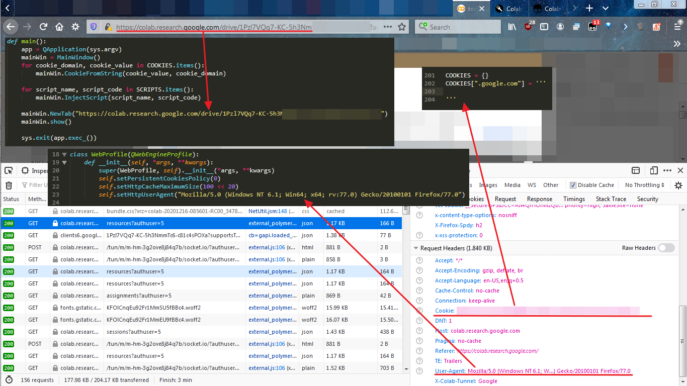

## Tổng quan
Sau vài tháng sử dụng google colab thì hôm may mới viết bài này để giải quyết vấn đề về "kéo dài sự sống" cho google colab. 

Cụ thể, khi sử dụng google colab để làm việc như đào tạo mô hình học máy, hay crack mật khẩu thì mất kha khá thời gian, ở bản miễn phí của colab thì chắc các bạn đã biết thời gian chạy 1 dự án tối đa là 12 tiếng. 

Ban đầu tui cũng chủ quan, tui mở 1 tab cho dự án colab để nó chạy đào tạo mô hình, thời gian cũng ngắn không quá 12 tiếng, thì thời gian còn lại rảnh quá, tui mở 1 tab khác để xem youtube. Sau vài tiếng quay lại tab ban đầu xem kết quả thì bùm, cái dự án đang chạy biến mất, sạch không tì vết.

Tui không hiểu tại sao, nhưng tui đoán là cái máy ảo chạy dự án đã tự khởi động lại nên nó xóa hết cmn rồi.

Sau đó tui lần lần mò google với từ khóa **colab alive** thì dẫn tui đến stackoverflow với câu hỏi [How to prevent Google Colab from disconnecting?](https://stackoverflow.com/questions/57113226/how-to-prevent-google-colab-from-disconnecting) và thêm được thông tin sau:

*Google Colab notebooks có thời gian chờ không hoạt động là 90 phút và thời gian chờ tuyệt đối là 12 giờ. Điều này có nghĩa là, nếu người dùng không tương tác với Google Colab notebooks của mình trong hơn 90 phút, phiên bản của nó sẽ tự động bị chấm dứt. Ngoài ra, thời gian tồn tại tối đa của một phiên bản Colab là 12 giờ.*

Thế là đã rõ, nếu bạn không tương tác với Colab trong khoảng thời gian 90 phút thì nó sẽ ngắt kết nối đến máy ảo colab và khởi động lại mọi thứ, hàng miễn phí mà, không làm gì thì tắt để người khác sử dụng. Vậy trong thời gian 90 phút đổ lại bạn phải làm vài trò mèo để Colab hiểu là bạn đang tương tác với nó, mặc dù bạn đang chạy đào tạo mô hình hoặc crack mật khẩu wifi. Hơn nữa bạn nên lưu kết quả của mình vào tập tin và thường xuyên cập nhật nó lên google drive để tránh mất mát dữ liệu.

Vậy có cách nào giải quyết vấn đề trên không, để dự án có thể chạy tối đa 12 tiếng. Tất nhiên là có, trong câu hỏi hồi nãy trên stackoverflow có vài đoạn mã js dùng để làm trò mèo trên Colab để giải quyết vấn đề chúng ta đang gặp phải.

Đây là đoạn mã tui thấy nó hiệu quả với tui tính đến thời điểm viết bài viết này 15/12/2020.

```
function ClickConnect(){
        console.log("Working");
        try{
            document.querySelector("colab-connect-button").click();
        }catch(e){}
    }
setInterval(ClickConnect,60000);
```

Ok, có mã js rồi thì làm sao chèn nó vào trình duyệt cho nó chạy được đây. Sau đây là vài cách tui nghĩ ra.

## Giải pháp
### Bookmarklet
Sao chép đoạn mã sau vào bookmarklet nhé. Còn bookmarklet là gì ? Và thêm code js như thế nào ? thì google và youtube sẽ giải đáp nhé.
```
javascript:(function(){function ClickConnect(){console.log("Working");try{document.querySelector("colab-connect-button").click();}catch(e){}} setInterval(ClickConnect,60000);})();
```

### Sử dụng tiện ích (phần mở rộng) trình duyệt
Ở đây tui không nghĩ đến việc phải viết 1 cái addon (extension), mà là sử dụng cái có sẵn cho phép ta thêm mã js tùy biến của mình vào. Cụ thể đó là **Tampermonkey**, **Greasemonkey**, ... mấy cái trên là gì thì google tiếp nhé :).

Sau khi cài đặt xong một trong hai thằng trên thì vào [link này](https://greasyfork.org/en/scripts/418770-colab-alive) hoặc [link này](https://gist.github.com/NguyenKhong/614f80ffe1a9e68bb402c092c0f18708) để cài đặt code js. 

Sau đó hưởng thụ thôi :).

### Trùm cuối - tạo luôn cái trình duyệt để giữ colab sống lâu :)
Ở [bài viết trước](https://nhtcntt.blogspot.com/2020/12/tu-tao-1-chiec-trinh-duyet-web-mini.html) tui có hướng dẫn làm cái trình duyệt mini dựa trên Qt. Hôm nay, chúng ta sẽ sử dụng lại nó và tùy biến vài thứ để có thế nhúng mã js và thực thi nó. Tại sao có phần này thì sẽ có một bài viết nữa giải thích cho cái sự điên rồ này.

Cũng trong bài viết trước, ở cuối bài viết ta có tạo một lớp WebProfile kế thừa lớp QWebEngineProfile để tạo trình duyệt ẩn danh và theo như mô tả [QWebEngineProfile](https://doc.qt.io/qt-5/qwebengineprofile.html#details) sẽ chứa thông tin về thiết đặt trình duyệt, các thiết lập về cookie, scripts và danh sách các url đã truy cập. Vậy nên hôm nay ta sẽ viết thêm vài phương thức để có thể nhúng mã js và thêm cookie.

Hiểu thêm về profile. Ví dụ bạn muốn chạy nhiều tài khoản facebook thì làm như thế nào ? Để giải quyết vấn đề này thì chúng ta chỉ cần phân chia mỗi tài khoản một profile khác nhau. Lúc cần tài khoản nào thì trỏ đến profile đó là được. Còn tạo và phân chia như thế nào thì hỏi google thôi **cách tạo profile chrome/firefox**.  (^.^)
#### Khai báo và tạo mã js
Quay lại vấn đề nhúng mã js. Để làm điều đó ta phải khai báo và tạo mã js trước đã. Sau đây là code 
```
def create_script(name, src, injection_point = QWebEngineScript.DocumentCreation, world = QWebEngineScript.MainWorld, on_subframes = True):
    script = QWebEngineScript()
    script.setSourceCode(src)
    script.setName(name)
    script.setWorldId(world)
    script.setInjectionPoint(injection_point)
    script.setRunsOnSubFrames(on_subframes)
    return script
```

Đoạn code trên dùng [QWebEngineScript](https://doc.qt.io/qt-5/qwebenginescript.html#details) để nhúng mã js vào chương trình của chúng ta. Cụ thể, chúng ta sẽ chỉ định mã nguồn (setSourceCode), tên (setName), được thực thi lúc nào (setInjectionPoint), chạy trong không gian nào (setWorldId) và có chạy trên iframe không (setRunsOnSubFrames).

Với [InjectionPoint](https://doc.qt.io/qt-5/qwebenginescript.html#InjectionPoint-enum) chúng ta sẽ có 3 nơi chạy mã js:
* **DocumentCreation** thực thi mã js lúc mới dựng xong DOM.
* **DocumentReady** thực thi mã js lúc DOM đã sẵn sàng <=> DOMContentLoaded hay $( document ).ready()
* **Deferred** thực thi mã js khi quá trình tải trang kết thúc hoặc sau 500 mili giây kể từ khi DOM sẵn sàng, tùy điều kiện nào đến trước.

Với [WorldId](https://doc.qt.io/qt-5/qwebenginescript.html#ScriptWorldId-enum) cũng có 3 nơi để thực thi và cả 3 nơi này đều truy cập được đến DOM. Vì kiến thức có hạn nên chưa hiểu rõ hết cái WorldId này là gì nên mong quý bạn đọc thông cảm. 

#### Thiết lập cookie
Để thiết lập cookie chúng ta sẽ có đoạn code sau.
```
def setCookie(self, key, value, domain):
    c = QNetworkCookie()
    c.setDomain(domain)
    c.setName(bytes(key, "utf-8"))
    c.setValue(bytes(value, "utf-8"))
    self.cookieStore().setCookie(c)
```
Để quản lý cookie ta sẽ dùng [QNetworkCookie](https://doc.qt.io/qt-5/qnetworkcookie.html). Vì nó khá đơn giản nên tui không giải thích gì thêm. (^.^)

#### Thêm mã js vào profile.
Để thêm mã js của chúng ta vào profile, chúng ta có code sau.
```
def injectScript(self, name, code):
    self.scripts().insert(create_script(name, code))
```

#### Tổng kết
Tổng kết lại chúng ta sẽ có một lớp WebProfile hoàn chỉnh như sau.
```
def create_script(name, src, injection_point = QWebEngineScript.DocumentCreation, world = QWebEngineScript.MainWorld, on_subframes = True):
    script = QWebEngineScript()
    script.setSourceCode(src)
    script.setName(name)
    script.setWorldId(world)
    script.setInjectionPoint(injection_point)
    script.setRunsOnSubFrames(on_subframes)
    return script

class WebProfile(QWebEngineProfile):
    def __init__(self, *args, **kwargs):
        super(WebProfile, self).__init__(*args, **kwargs)
        self.setPersistentCookiesPolicy(0)
        self.setHttpCacheMaximumSize(100 << 20)
        self.setHttpUserAgent("Mozilla/5.0 (Windows NT 6.1; Win64; x64; rv:77.0) Gecko/20100101 Firefox/77.0")

    def cookieFromString(self, raw, domain):
        cookies = {}
        for cookie in raw.split(";"):
            cookie = cookie.strip()
            if not cookie: continue
            key, value = cookie.split("=", 1)
            self.setCookie(key.strip(), value.strip(), domain)

    def setCookie(self, key, value, domain):
        c = QNetworkCookie()
        c.setDomain(domain)
        c.setName(bytes(key, "utf-8"))
        c.setValue(bytes(value, "utf-8"))
        self.cookieStore().setCookie(c)

    def injectScript(self, name, code):
        self.scripts().insert(create_script(name, code))
```

Cơ bản thì profile này là profile cho phép chúng ta chạy trình duyệt ẩn danh, thiết lập cookie và nhúng mã js.

Vậy mã js của chúng ta có gì đặc biệt không tất nhiên có hoặc không (^.^). Thực ra thì bạn có thể copy cái mã js trong Tampermonkey/Greasemonkey bên trên để chạy cũng được chả sao, nó tương thích khá tốt.  Bạn có thể xem qua phần [Script Injection](https://doc.qt.io/qt-5/qtwebengine-overview.html#script-injection) để hiểu rõ hơn. 

> Mẹo: Chạy mã js trong Tampermonkey/Greasemonkey trước, nếu nó ổn định thì mới copy nó vào code của chúng ta.

Dành cho bạn nào đã từng viết js trong Tampermonkey/Greasemonkey, thì từ Qt 5.8 các thuộc tính được hỗ là: *@exclude*, *@include*, *@match*, *@name* và *@run-at*.

Sau tất cả chúng ta sẽ có được thành quả là [đây](https://gist.github.com/NguyenKhong/a0502eff97d1e1607a374e2fe89d3d9c).

Hướng dẫn sử dụng code (>.<).
Truy cập vào colab của bạn, sau đó mở **devtool** lên, sang tab **Network**. Chọn 1 url bất kỳ sau đó copy **Cookie** và **User-Agent** vào code. Thay đổi url sang url của bạn. 


Tạo xong rồi giờ chạy cái web browser mini này ở đâu. Thì chạy ở máy tính của bạn đó hoặc chạy trên vps windows, chỉ cần cài vài thứ là chạy ngon lành rồi.

Bài viết [này](https://nhtcntt.blogspot.com/2020/12/tong-quan-o-bai-viet-hom-truoc-chung-ta.html) sẽ chỉ cách chạy trên chính colab luôn nhé ! (^v^)

## HẾT