## Kết hợp Fiddler và Python bắt HTTP(S)

### 1. Cấu hình Fiddler.

Đầu tiên chúng ta cấu hình Fiddler nhận dữ liệu HTTP(S) từ các tiến trình (process).
<p align="center">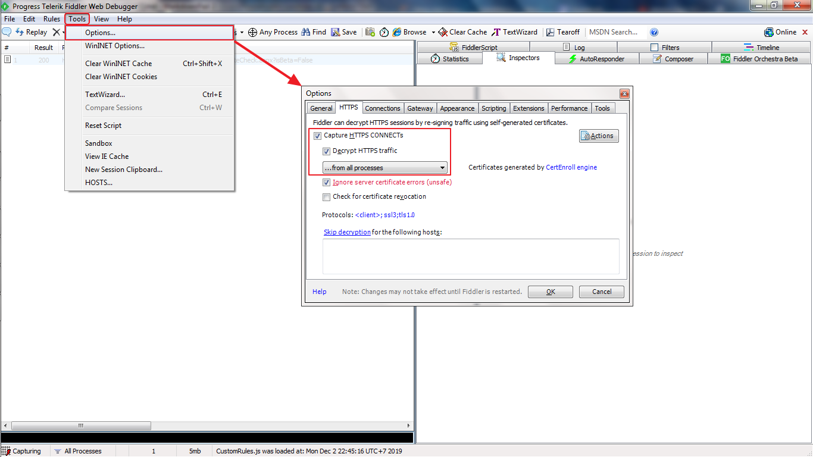</p>

Sau đó trích xuất **CA certificate** ra Desktop.
<p align="center">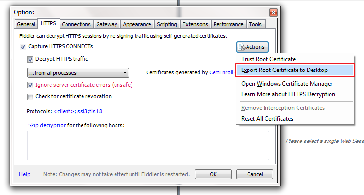</p>

Chúng ta nhận được cửa sổ thông báo xuất tập tin **FiddlerRoot.cer** thành công.
<p align="center">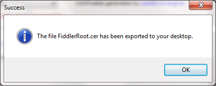</p>

Tại Desktop chúng ta sẽ thấy tập tin **FiddlerRoot.cer**
<p align="center">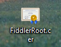</p>

Hiện tại tập tin này đang lưu trữ dữ liệu ở dạng **DER**. Chúng ta sẽ chuyển nó về định dạng **PEM**, vì thư viện **requests** của python yêu cầu như vậy. Chi tiết về các định dạng trên các bạn có thể xem [tại đây](http://www.gtopia.org/blog/2010/02/der-vs-crt-vs-cer-vs-pem-certificates/)

Nháy đúp chuột vào tập tin **FiddlerRoot.cer**. Nó sẽ hiện ra cửa sổ sau. 
<p align="center">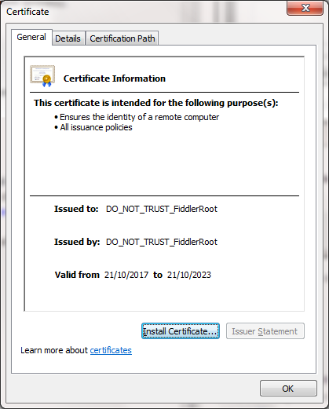</p>

Chọn thẻ **Details**. Rồi click nút **Copy to File...**
<p align="center">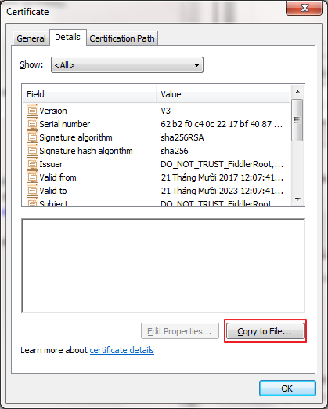</p>

Chọn **Next**.
<p align="center"></p>

Chọn tiếp **Base-64 encoded X.509 (.CER)**. Rồi **Next**.
<p align="center">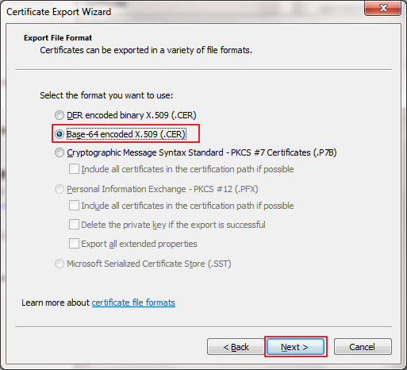</p>

Sau đó đặt cho tập tin mới. Rồi **Next** -> **Finish**. Xong 
<p align="center">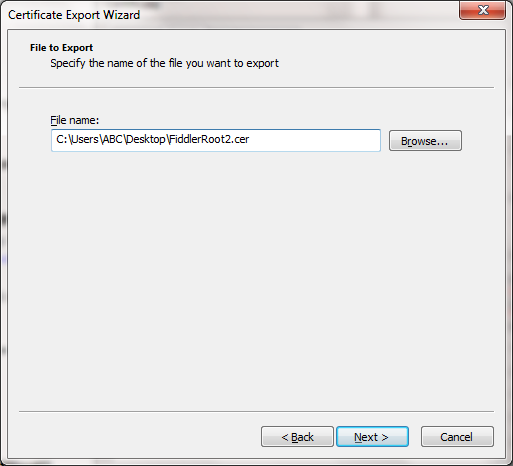</p>
<p align="center"></p>

Để chỉnh cổng (port) lắng nghe của proxy server vào **Tools > Options... > Connections**. Chỉ định cổng kết nối tại **Fiddler listens on port:**.
<p align="center">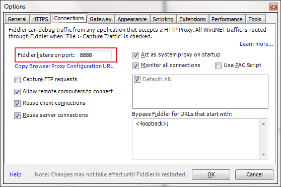</p>

### 2. Cấu hình Python.
Chúng ta sẽ tìm kiếm và biên tập tập tin **cacert.pem**.

Để tìm kiếm một cách nhanh chóng, tôi dùng phần mềm **Everything** để tìm kiếm tập tin trên.
<p align="center">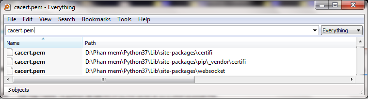</p>

Trước tiên mở tập tin **FiddlerRoot2.cer** vừa mới lưu lúc nãy. Sau đó sao chép nội dung của nó sang cho các tập tin **cacert.pem** vừa tìm được. Tại sao lại có bước này? Nếu bạn muốn tìm hiểu thì có thể đọc bài viết này [HTTP(S) proxy server hoạt động như thế nào ?](https://nhtcntt.blogspot.com/2019/11/https-proxy-server-hoat-ong-nhu-nao.html).
<p align="center">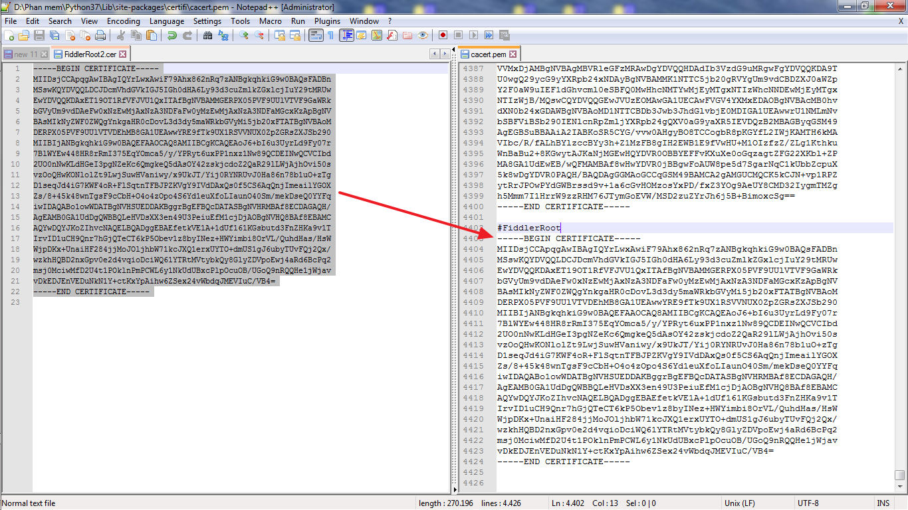</p>

Để bắt HTTP(S) ta gán các biến môi trường sau:

```
Trong code python
import os
os.environ['HTTP_PROXY'] = "http://127.0.0.1:8888"
os.environ['HTTPS_PROXY'] = "http://127.0.0.1:8888"

# cmd
set HTTP_PROXY=http://127.0.0.1:8888
set HTTPS_PROXY=http://127.0.0.1:8888

#terminal
export HTTP_PROXY="http://IP_Fiddler:8888"
export HTTPS_PROXY="http://IP_Fiddler:8888"
```

Kiểm tra thử
<p align="center">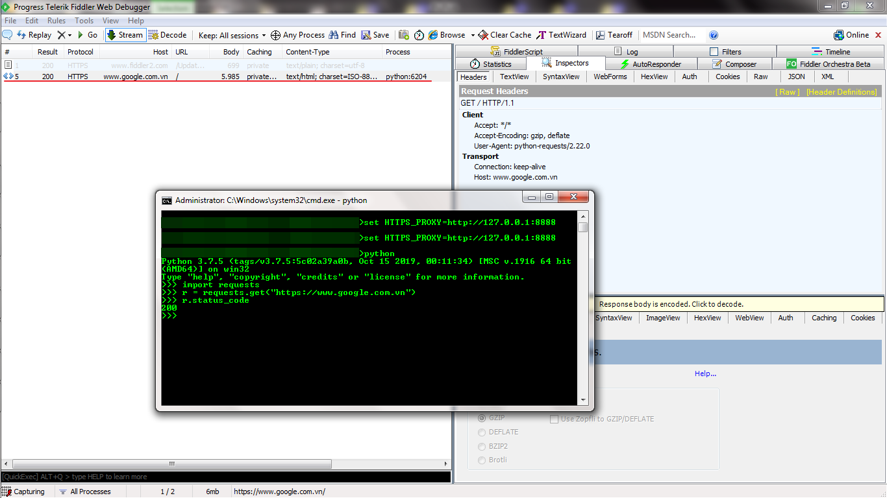</p>

## HẾT


