## Làm thế nào mà trang web có thể phát video.

Bài viết này được dịch và biên soạn lại từ bài viết gốc: [https://medium.com/canal-tech/how-video-streaming-works-on-the-web-an-introduction-7919739f7e1](https://medium.com/canal-tech/how-video-streaming-works-on-the-web-an-introduction-7919739f7e1).

> Chú ý: Bài viết này giới thiệu về công nghệ video stream trong Javascript và đối tượng hướng đến là các nhà phát triển web. Phần lớn ví dụ trong bài này là mã HTML và Javascript ES6. <br>
> Nếu bạn không quen thuộc với chúng thì có lẽ sẽ khó khăn cho bạn khi gặp các ví dụ về code. <br>
> Xin lỗi về điều này.
### Sự cần thiết về một API trình duyệt hỗ trợ chơi video.
Từ đầu những 2000, việc xem video trên trình duyệt hầu hết đều phải dựa vào các **flash plugin**.
<p align="center">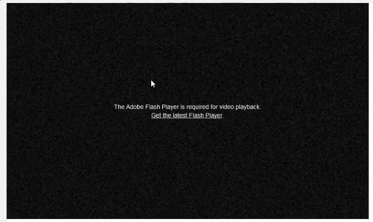</p>

Bởi vì, tại thời điểm đó, chả có cách nào phát video trên trình duyệt cả. Lúc này bạn có 2 lựa chọn, 1 là cài các plugin của bên thứ 3 như là flash hoặc Silverlight hoặc 2 bạn không thể phát mọi video được.

Để lấp đầy lỗ hổng này, *WHATWG* bắt đầu làm việc với phiên bản mới của chuẩn HTML, bao gồm nhiều thứ trong đó có cho phép chơi video và audio trên trình duyệt mà không cần plugin nào cả. Và chuẩn này được biết với cái tên quen thuộc ngày nay là HTML5. 
 <p align="center"></p><br>
Và HTML5 mang đến web một thẻ <code>&#x3Cvideo&#x3E</code>. Thẻ mới này cho phép bạn nhúng trực tiếp link video vào HTML và phát nó ngay trên trình duyệt. 

Cái này có vẻ hay ho, nhưng nó chưa tốt bằng flash. Có vài vấn đề sau:
* Khi bạn xem video youtube bạn có thể chọn nhiều chất lượng video khác nhau. Tải video trước khi xem.
* Với live streaming, trông có vẻ khó khăn để thực hiện nó.
*  Khi xem phim trên Netflix bạn có thể chọn ngôn ngữ cho âm thanh mà bạn thích, nhưng chỉ với thẻ video trên thì chưa đủ.

Nhưng rất may mắn, ngày nay các trình duyệt đều hỗ trợ các API để phát video, đều nhờ vào các đặc tả kĩ thuật mà HTML5 mang đến cho chúng ta. Bài viết này sẽ đi chi tiết làm thế nào mà các trang web ngày nay làm những điều trên.
### Thẻ video.
Như đã nói ở phần trước, rất dễ để nhúng một video vào HTML. Sau đây là ví dụ:
```
<html>
  <head>
    <meta charset="UTF-8">
    <title>My Video</title>
  </head>
  <body>
    <video id="myVideo" src="some_video.mp4" width="1280px" height="720px" />
  </body>
</html>
```
Với đoạn code trên bạn có thể phát video ngay trên trình duyệt đã hỗ trợ HTML5 và codec tương ứng. Trông nó sẽ như thế này:
 <p align="center">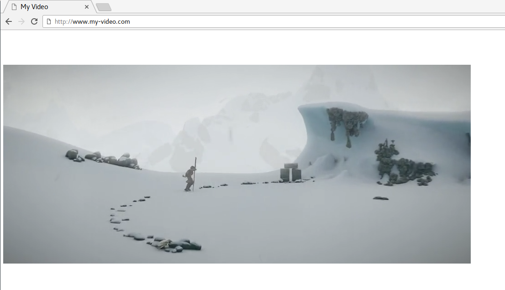</p>

Thẻ video này cũng hỗ trợ vài API như *play, pause, seek* hoặc *change* để thay đổi tốc độ khi phát video.
Những API được truy cập trực tiếp thông qua JS.
```
var myVideo = document.getElementById("myVideo");

//pause the video
myVideo.pause()

// seek to 10 seconds
myVideo.currentTime = 10;
```
Tuy nhiên, hầu hết các video chúng ta thấy trên web hiện nay có hành vi phức tạp hơn nhiều so với những gì này có thể cho phép. Ví dụ, chuyển đổi chất lượng video và cho phép phát trực tiếp (live streaming).
<p align="center">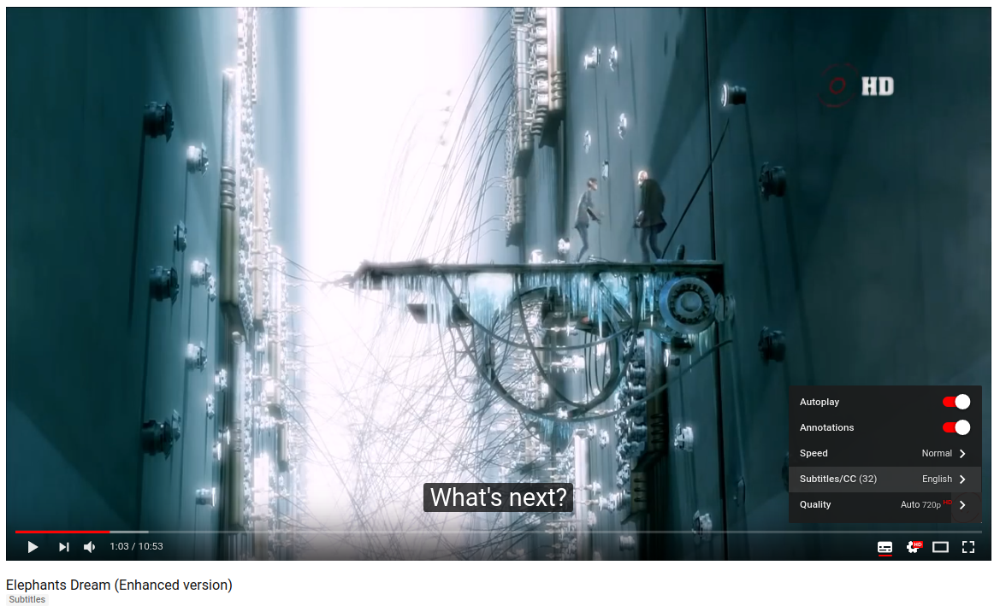</p>

Thật ra các web này vẫn có thẻ video trong mã HTML, nhưng thay vì thiết đặt đường dẫn tập tin video trong thuộc tính *src*, họ lại sử dụng các web API mạnh mẽ hơn như là **Media Source Extensions**.
### Media Source Extensions ?
**Media Source Extensions (MSE)** là một đặc tả kĩ thuật của W3C mà các trình duyệt này nay triển khai. Tức là trình duyệt cung cấp các API này cho chúng ta sử dụng, nhưng tuân theo đặc tả kĩ thuật mà W3C cung cấp. 

Các API này cho phép ta triển khai các tác vụ phức tạp liên quan đến media nhờ sự hỗ trợ của JS và HTML. 

Media Source Extensions dịch ra mở rộng nguồn đa phương tiện, đa phương tiện là video, audio, image, ... Đồng thời cung cấp đối tượng **MediaSource** cho JS để quản lý những nguồn này.
 <p align="center">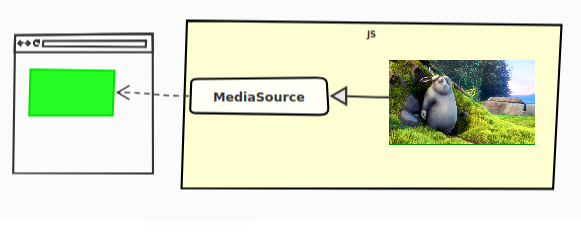</p>

Như đã đề cập trước đó, chúng ta vẫn dùng đến thẻ video nhưng thuộc tính *src* của thẻ này thay vì liên kết đến video thì nó lại được liên kết đến đối tượng **MediaSource**.

Làm sao mà thuộc tính *src* lại liên kết với đối tượng **MediaSource** được vì thuộc tính này cần cung cấp một URL mà, lạ nhỉ !

Để cho phép điều này W3C đã định nghĩa một phương thức tĩnh : `URL.createObjectURL`. API này cho phép tạo ra một URL, nhưng URL này không liên kết đến tài nguyên trực tuyến trên mạng mà lại liên kết trực tiếp đến một đối tượng trong JS ngay trên trình duyệt. Hay ho chưa!
Và đây là một ví dụ đơn giản:
```
const videoTag = document.getElementById("my-video");

// creating the MediaSource, just with the "new" keyword, and the URL for it
const myMediaSource = new MediaSource();
const url = URL.createObjectURL(myMediaSource);
// example: url = blob:http://localhost/a887d991-19c2-4268-a0f4-b6cbd71ec815

// attaching the MediaSource to the video tag
videoTag.src = url;
```
Vậy tới đây là đủ à? Chưa, chưa đủ đâu, bạn phải làm vài thứ nữa.
Đặc tả kĩ thuật của MSE chưa dừng ở đây, nó còn định nghĩa những khái niệm khác nữa, trong đó có **SourceBuffers**.
### Source Buffers
Dữ liệu media thật sự thì không được đẩy thẳng vào **MediaSource** mà nó được đẩy  vào **SourceBuffers** trước.<br>
Một MediaSource chứa một hoặc nhiều đối tượng media khác nhau.
Để đơn giản, chúng ta chỉ xét những kiểu đối tượng media sau:
* audio
* video 
* cả audio và video
> Trong thực tế kiểu (type) media được định nghĩa thông qua kiểu MIME (MIME type) của nó, cũng có khi bao gồm cả codec của media nữa. <br>
> Ví dụ cho dễ hiểu, ví dụ bạn có MIME type "video/mp4" và codec "avc1.4d4016" thì nó thuộc kiểu video định dạng mp4 với mã hóa (encode) AVC.

Tất cả các **SourceBuffers** đều được liên kết với một **MediaSource**, và mỗi cái sẽ được dùng để thêm dữ liệu vào trong thẻ video của HTML5 trực tiếp thông qua JS. 

Ví dụ, bạn có 2 nguồn dữ liệu một video, một audio, tương ứng mỗi cái là một SourceBuffer, được quản lý bởi MediaSource.
<p align="center">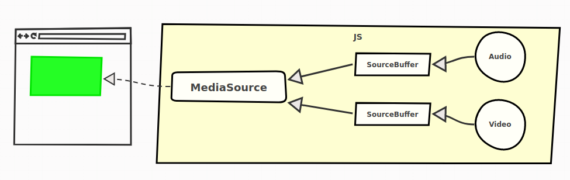</p>

Tách biệt video và audio cho phép chúng ta dễ quản lý chúng phía server. Đồng thời cũng mang lại lợi ích sau này. Và đây là cách nó hoạt động:
```
// -- Create a MediaSource and attach it to the video (We already learned about that) --

const videoTag = document.getElementById("my-video");
const myMediaSource = new MediaSource();
const url = URL.createObjectURL(myMediaSource);
videoTag.src = url;

// 1. add source buffers

const audioSourceBuffer = myMediaSource
  .addSourceBuffer('audio/mp4; codecs="mp4a.40.2"');
const videoSourceBuffer = myMediaSource
  .addSourceBuffer('video/mp4; codecs="avc1.64001e"');

// 2. download and add our audio/video to the SourceBuffers

// for the audio SourceBuffer
fetch("http://server.com/audio.mp4").then(function(response) {
  // The data has to be a JavaScript ArrayBuffer
  return response.arrayBuffer();
}).then(function(audioData) {
  audioSourceBuffer.appendBuffer(audioData);
});

// the same for the video SourceBuffer
fetch("http://server.com/video.mp4").then(function(response) {
  // The data has to be a JavaScript ArrayBuffer
  return response.arrayBuffer();
}).then(function(videoData) {
  videoSourceBuffer.appendBuffer(videoData);
});
```
Và bây giờ, thì chúng ta có thể tự thêm dữ liệu video và audio động vào thẻ video, mà không còn phải cứng nhắc như trước nữa.
 
Tìm hiểu thêm về video và audio. Như các ví dụ trên đề cập thì định dạng được sử dụng là MP4.<br>
MP4 là một định dạng thùng chứa (container format), nó chứa dữ liệu đa phương tiện, đồng thời chứa siêu dữ liệu (metadata) như là, thời gian bắt đầu, độ dài ra của video chẳng hạn.<br>

 Đặc tả kĩ thuật MSE không bắt buộc một định dạng cụ thể nào, mà định đạng đó phải được trình duyệt hiểu (hỗ trợ) thì mới sử dụng được. Về dữ liệu video thì có 2 định dạng phổ biến là MP4 và WEBM được hỗ trợ bởi hầu hết trình duyệt.
### Media Segments
Vẫn còn nhiều câu hỏi chưa được trả lời ở đây:
* Có phải chúng ta phải đợi dữ liệu được tải về hết, rồi mới đẩy nó vào SourceBuffer thì sau đó mới xem được nó ?
* Làm sao để chuyển chất lượng video hay đổi ngôn ngữ audio ?
* Làm sao để phát video trực tiếp khi mà dữ liệu media vẫn chưa hoàn thành ?

Trong ví dụ từ bài trước, chúng ta đã có một tập tin đại diện cho âm thanh và một tập tin đại diện cho video. Điều này có thể là đủ đối với trường hợp sử dụng thực sự đơn giản, nhưng không đủ nếu bạn muốn sự phức tạp hơn được cung cấp bởi hầu hết các trang web trực tuyến (đổi ngôn ngữ, chuyển chất lượng, phát trực tuyến, ...).

Điều gì thật sự xảy ra trong các trình phát video tiên tiến, đó là dữ liệu video và audio được chia thành nhiều phân đoạn (segments). Những phân đoạn này có kích thước khác nhau, nhưng thường có thời lượng từ 2 đến 10 giây.
<p align="center">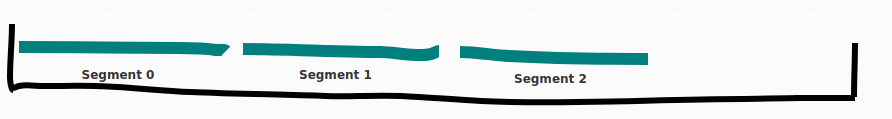</p>

Và bây giờ thay vì đẩy một đống dữ liệu media và chờ nó tải xong thì bạn chỉ cần đẩy từng mảnh dữ liệu một vào SourceBuffers là có thể phát được video rồi.

Sau đây là ví dụ đơn giản:
```
// ... (definition of the MediaSource and its SourceBuffers)

/**
 * Fetch a video or an audio segment, and returns it as an ArrayBuffer, in a
 * Promise.
 * @param {string} url
 * @returns {Promise.<ArrayBuffer>}
 */
function fetchSegment(url) {
  return fetch(url).then(function(response) {
    return response.arrayBuffer();
  });
}

// fetching audio segments one after another (notice the URLs)
fetchSegment("http://server.com/audio/segment0.mp4")
  .then(function(audioSegment0) {
    audioSourceBuffer.appendBuffer(audioSegment0);
  })

  .then(function() {
    return fetchSegment("http://server.com/audio/segment1.mp4");
  })
  .then(function(audioSegment1) {
    audioSourceBuffer.appendBuffer(audioSegment1);
  })

  .then(function() {
    return fetchSegment("http://server.com/audio/segment2.mp4");
  })
  .then(function(audioSegment2) {
    audioSourceBuffer.appendBuffer(audioSegment2);
  })

  // ...

// same thing for video segments
fetchSegment("http://server.com/video/segment0.mp4")
  .then(function(videoSegment0) {
    videoSourceBuffer.appendBuffer(videoSegment0);
  });

// ...
```
Điều này có nghĩa là ở trên server phải có những tập tin phân đoạn. Và với ví dụ trên thì server sẽ có những tập tin sau:
```
./audio/
  ├── segment0.mp4
  ├── segment1.mp4
  └── segment2.mp4
./video/
  └── segment0.mp4
```
> Nếu web server có hỗ trợ HTTP Header Range thì chúng ta cũng không cần chia nhiều tập tin như trên mà chỉ cần một tập tin mỗi loại thôi cũng được.

Thông thường chỉ cần mảnh đầu tiên của dữ liệu media là có thể phát được video rồi, không cần phải chờ tải hết các mảnh.<br>

Để thấy được các mảnh media được tải xuống như thế nào, bạn có mở **Chrome dev tool** hoặc **Firefox dev tool** lên chuyển sang thẻ **Network**, và mở một video youtube chẳng hạn bạn sẽ thấy nó được tải như thế nào.<br>
Ví dụ nè:
<p align="center">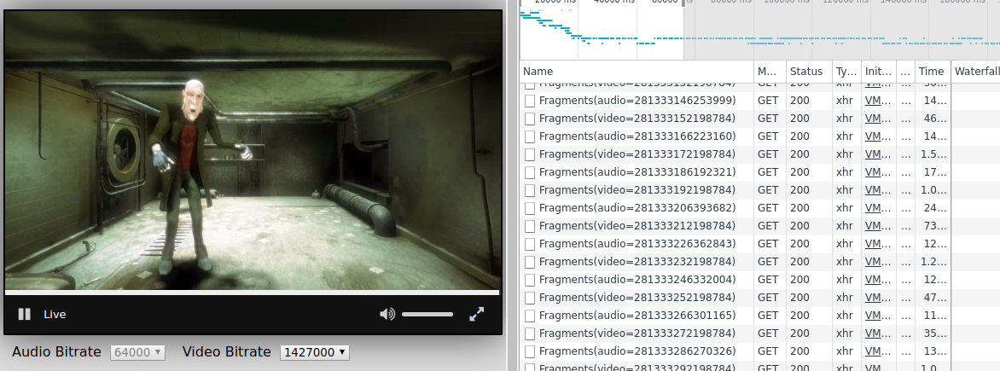</p>

### Adaptive Streaming
Nhiều trình phát video có tính năng tự chuyển đổi chất lượng. Việc chuyển đổi chất lượng dựa vào chất lượng mạng (tốc độ mạng), hoặc dựa vào hành vi của người dùng.

Cái này được gọi là Adaptive Streaming (dịch nôm na là dòng dữ liệu thích nghi).<br>
Ví dụ cho dễ hiểu nè:<br>
<p align="center">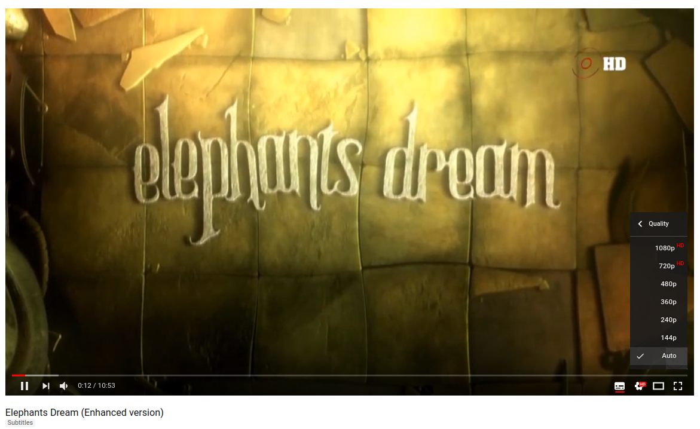</p>

Vậy làm sao để làm được điều này.

Ở trên máy chủ, chúng ta chia dữ liệu media thành nhiều phân đoạn, với nhiều chất lượng khác nhau. Ví dụ, máy chủ chúng ta sẽ có các tập tin sau:
```
./audio/
  ├── ./128kbps/
  |     ├── segment0.mp4
  |     ├── segment1.mp4
  |     └── segment2.mp4
  └── ./320kbps/
        ├── segment0.mp4
        ├── segment1.mp4
        └── segment2.mp4
./video/
  ├── ./240p/
  |     ├── segment0.mp4
  |     ├── segment1.mp4
  |     └── segment2.mp4
  └── ./720p/
        ├── segment0.mp4
        ├── segment1.mp4
        └── segment2.mp4
```
Trình phát media (media player) sẽ tự động chọn phân đoạn để tải về phụ thuộc vào chất lượng mạng hoặc điều kiện của CPU, hoặc người dùng tùy chỉnh.<br>
 Và sau đây là một ví dụ với mã JS:
```
/**
 * Push audio segment in the source buffer based on its number
 * and quality
 * @param {number} nb
 * @param {string} language
 * @param {string} wantedQuality
 * @returns {Promise}
 */
function pushAudioSegment(nb, wantedQuality) {
 // The url begins to be a little more complex here:
 const url = "http://my-server/audio/" +
 wantedQuality + "/segment" + nb + ".mp4");
return fetch(url)
 .then((response) => response.arrayBuffer());
 .then(function(arrayBuffer) {
 audioSourceBuffer.appendBuffer(arrayBuffer);
 });
}

/**
 * Translate an estimated bandwidth to the right audio
 * quality as defined on server-side.
 * @param {number} bandwidth
 * @returns {string}
 */
function fromBandwidthToQuality(bandwidth) {
 return bandwidth > 320e3 ? "320kpbs" : "128kbps";
}

// first estimate the bandwidth. Most often, this is based on
// the time it took to download the last segments
const bandwidth = estimateBandwidth();

const quality = fromBandwidthToQuality(bandwidth);

pushAudioSegment(0, quality)
 .then(() => pushAudioSegment(1, quality))
 .then(() => pushAudioSegment(2, quality));
```
Như bạn có thể thấy, chúng ta chả gặp phải vấn đề gì khi đặt các phân đoạn media khác nhau cùng với nhau. Trong bất kì trường hợp nào, tập tin containter (mp4, webm) chứa đủ thông tin cho phép quá trình xử lý diễn ra trơn tru.
### Chuyển đổi ngôn ngữ.
Với các trình phát video phức tạp hơn như Netfilx, Amazon Prime Video, ... Nó cho phép chuyển đổi ngôn ngữ âm thanh dựa vào các thiết lập của người dùng. <br>
<p align="center">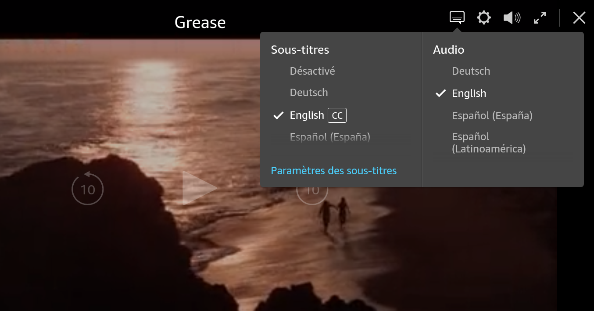</p>

Chắc tới đây bạn cũng biết phải làm gì rồi phải không.

Cũng giống adaptive streaming, chúng ta cũng phải chia nhiều phân đoạn cho nhiều loại ngôn ngữ khác nhau. Trên máy chủ sẽ như vầy:
```
./audio/
  ├── ./esperanto/
  |     ├── segment0.mp4
  |     ├── segment1.mp4
  |     └── segment2.mp4
  └── ./french/
        ├── segment0.mp4
        ├── segment1.mp4
        └── segment2.mp4
./video/
  ├── segment0.mp4
  ├── segment1.mp4
  └── segment2.mp4
```
Sau đây là một ví dụ cho việc chuyển đổi ngôn ngữ âm thanh này:
```
/**
 * Push audio segment in the source buffer based on its number and language.
 * @param {number} nb
 * @param {string} language
 * @returns {Promise}
 */
function pushAudioSegment(nb, language) {
  // construct dynamically the URL of the segment
  // and push it to the SourceBuffer
  const url = "http://my-server/audio/" +
    language + "/segment" + nb + ".mp4"
  return fetch(url);
    .then((response) => response.arrayBuffer());
    .then(function(arrayBuffer) {
      audioSourceBuffer.appendBuffer(arrayBuffer);
    });
}

// recuperate in some way the user's language
const language = getUsersLanguage();

pushAudioSegment(0, language)
  .then(() => pushAudioSegment(1, language))
  .then(() => pushAudioSegment(2, language));
```
Để tránh việc trộn lẫn âm thanh của những ngôn ngữ khác nhau chúng ta phải làm "sạch" SourceBuffer trước khi nạp âm thanh mới vào.

SourceBuffer có cung cấp cho chúng ta phương thức **SourceBuffer.prototype.remove** để làm điều này.
```
// Loại bỏ nội dung audio từ giây 0 đến 40. Trước khi chuyển sang audio mới.
audioSourceBuffer.remove(0, 40);
```
Tổng kết lại, nếu bạn kết hợp cả adaptive stream và chuyển đổi đa ngôn ngữ, dữ liệu trên máy chủ sẽ được tổ chức như sau:
```
./audio/
  ├── ./esperanto/
  |     ├── ./128kbps/
  |     |     ├── segment0.mp4
  |     |     ├── segment1.mp4
  |     |     └── segment2.mp4
  |     └── ./320kbps/
  |           ├── segment0.mp4
  |           ├── segment1.mp4
  |           └── segment2.mp4
  └── 
./french/
        ├── ./128kbps/
        |     ├── segment0.mp4
        |     ├── segment1.mp4
        |     └── segment2.mp4
        └── ./320kbps/
              ├── segment0.mp4
              ├── segment1.mp4
              └── segment2.mp4
./video/
  ├── ./240p/
  |     ├── segment0.mp4
  |     ├── segment1.mp4
  |     └── segment2.mp4
  └── ./720p/
        ├── segment0.mp4
        ├── segment1.mp4
        └── segment2.mp4
```
Và mã JS trên trình duyệt sẽ phải quản lý chất lượng mạng và ngôn ngữ, nên nó sẽ trông như vầy: 
```
/**
 * Push audio segment in the source buffer based on its number, language and quality
 * @param {number} nb
 * @param {string} language
 * @param {string} wantedQuality
 * @returns {Promise}
 */
function pushAudioSegment(nb, language, wantedQuality) {
  // The url begins to be a little more complex here:
  const url = "http://my-server/audio/" +
    language + "/" + wantedQuality + "/segment" + nb + ".mp4");

  return fetch(url)
    .then((response) => response.arrayBuffer());
    .then(function(arrayBuffer) {
      audioSourceBuffer.appendBuffer(arrayBuffer);
    });
}

const bandwidth = estimateBandwidth();
const quality = fromBandwidthToQuality(bandwidth);
const language = getUsersLanguage();
pushAudioSegment(0, language, quality)
  .then(() => pushAudioSegment(1, language, quality))
  .then(() => pushAudioSegment(2, language, quality));
```
### Live Contens - Nội dung trực tuyến.
Phát video trực tuyến trên web bây giờ rất phổ biến (Facebook, Youtube live streaming, ...) và thực tế là video và audio của chúng ta cũng là những tập tin được phân mảnh.
<p align="center">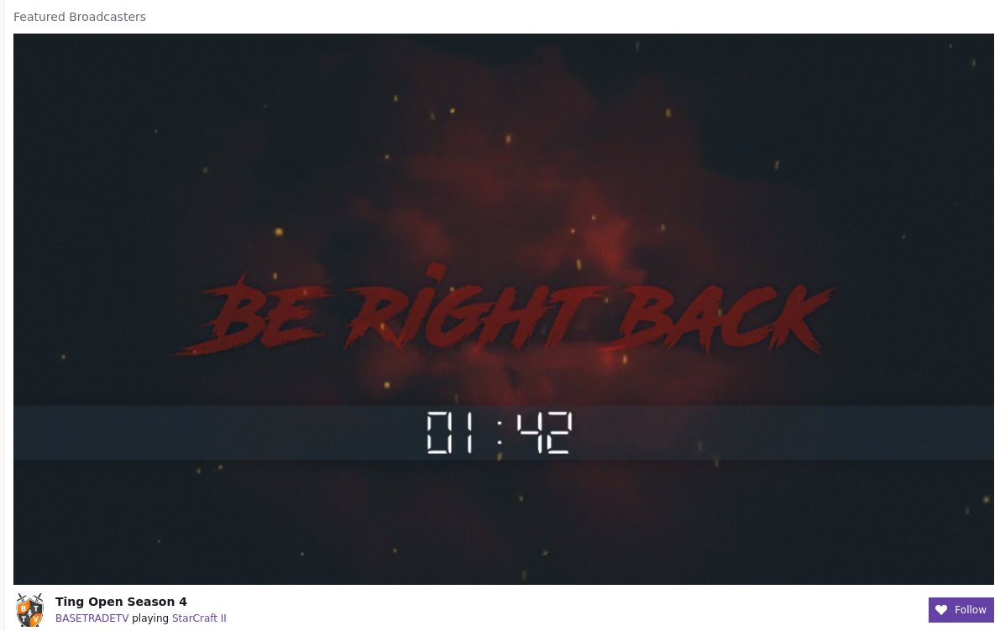</p>

Để giải thích làm thế nào nó hoạt động một cách đơn giản nhất, chúng ta sẽ xem xét một kênh Youtube vừa mới bắt đầu live streaming được 4 giây.

Sau khi ghi hình chúng ta sẽ có được một đoạn media (video+audio) dài, chúng ta sẽ chia đoạn media dài thành những đoạn nhỏ khoảng 2 giây. Và vì mới ghi hình được 4 giây nên trên máy chủ Youtube, chúng ta sẽ có:
* Một đoạn media bắt đầu từ giây 0 đến giây thứ 2, bao gồm 1 video + 1 audio.
* Đoạn media tiếp theo bắt đầu từ giây 2 đến giây thứ 4, lại bao gồm 1 video + 1 audio.
```
./audio/
  ├── segment0s.mp4
  └── segment2s.mp4
./video/
  ├── segment0s.mp4
  └── segment2s.mp4
``` 
Tại giây thứ 5, chúng ta chưa thể tạo ra đoạn media tiếp theo, nên trên máy chủ dữ liệu vẫn như cũ.<br>
Tại giây thứ 6, một đoạn media mới được tạo ra, bây giờ chúng ta có:
```
./audio/
  ├── segment0s.mp4
  ├── segment2s.mp4
  └── segment4s.mp4
./video/
  ├── segment0s.mp4
  ├── segment2s.mp4
  └── segment4s.mp4
```
Như chúng ta thấy bên trên, cứ sau mỗi 2 giây thì một phân đoạn media mới được tạo ra, nó không xuất hiện liên tục mà phải chờ một khoảng thời gian nhất định. 

Vậy tại trình duyệt web mà cụ thể là trong mã JS làm sao biết nội dung mới được tạo ra khi nào ?

Có lẽ chúng ta dùng một đồng hồ trên máy khách, bấm xem khi nào đủ 2 giây thì tạo request lên máy chủ lấy nội dung mới về. Chúng ta đặt tên phân đoạn theo một mẫu "segmentX.mp4", và X cứ tăng theo mỗi lần gọi (segment0.mp4, và 2 giây sau sẽ là segment1.mp4, ...).

Tuy nhiên, trong nhiều trường hợp, điều này có thể thiếu chính xác, cụ thể, như biến X ở trên có thể bị tràn số, hoặc có độ trễ tại máy chủ khi tạo ra phân đoạn media mới, hoặc máy chủ muốn xóa các phân đoạn cũ tiết kiệm không gian trống. Lúc này có thể request lên sẽ không được gì cả. 

 Tại máy khách, bạn muốn những phân đoạn media mới nhất ngay khi có thể mà vẫn tránh được việc request quá sớm khi mà phân đoạn mới chưa được tạo ra (có thể sẽ gặp phải lỗi HTTP 404).

Vấn đề này thường được giải quyết bằng cách dùng giao thức vận chuyển (transport protocol) đôi khi được gọi là giao thức truyền dẫn đa phương tiện (Streaming Media Protocol).
### Transport Protocols - Các giao thức truyền dẫn.
Giải thích các giao thức truyền dẫn khác nhau sẽ làm bài viết này quá dài. Chúng ta sẽ chỉ nói đến những khái niệm cốt lõi giống nhau: **Manifest** (bản kê khai).

Một **Manifest** là một tập tin mô tả các phân đoạn media hiện đang có trên máy chủ.
<p align="center">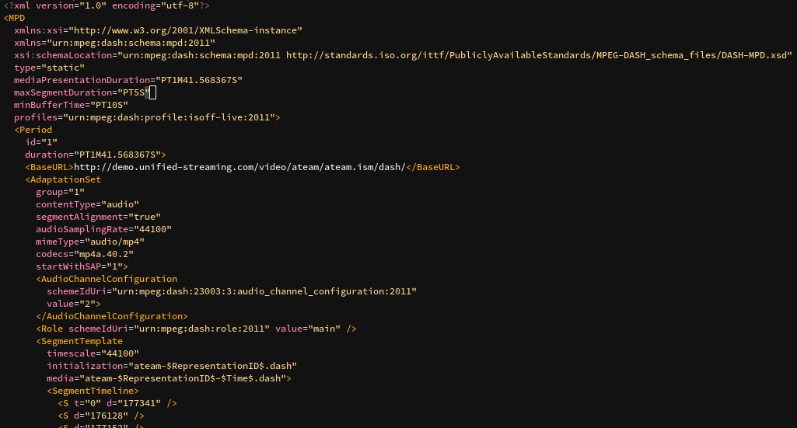</p>
<center>Hình trên là ví dụ về nội dung của DASH Manifest, dựa trên XML.</center>

Với Mainifest bạn có thể mô tả hầu hết mọi thứ chúng ta đã tìm hiểu trong bài viết này:
* Ngôn ngữ âm thanh nào đang có trên máy chủ và đường dẫn đến chúng (URL).
* Chất lượng các video và audio có trên máy chủ.
* Những phân đoạn media hiện đang có trên máy chủ trong ngữ cảnh live streaming.

Các giao thức vận chuyển hiện đang được sử dụng phổ biến là:
* **DASH**. Được sử dụng bởi Youtube, Netflix, Amazon Prime Video, và nhiều tổ chức khác. **DASH manifest** được gọi là **Media Presentation Description (MPD)** và nó dựa trên XML.
* **HLS**. Được phát triển bởi Apple, được dùng bởi DailyMotion, Twitch.tv, và nhiều tổ chức khác. **HLS manifest** được gọi là **playlist** và có định dạng **m3u8** (với tập tin m3u playlist, mã hóa UTF-8).
* **Smooth Streaming**. Được phát triển bởi Microsoft và dùng bởi Microsoft và MyCanal. Manifest của nó được gọi là manifest (^.^) và dựa trên XML.
### Trình phát video trên web mã nguồn mở.
Có rất nhiều trình phát video trên thế giới. Sau đây là các trình phát video mã nguồn mở:
* [rx-player](https://github.com/canalplus/rx-player): Có thể chơi cả nội dung DASH và Smooth Streaming. Được viết bằng TypeScript. 
* [dash.js](https://github.com/Dash-Industry-Forum/dash.js/): Phát được nội dung DASH, hỗ trợ nhiều tính năng của DASH. Được viết bởi DASH Industry Forum.
* [hls.js](https://github.com/video-dev/hls.js/): Tất nhiên là chơi được nội dung HLS rồi. Có mặt trong các sản phẩm của các ông lớn như Dailymontion, Twitter, VK, ...
* [shaka-player](https://github.com/google/shaka-player): Chơi được DASH và HLS. Được bảo trì bởi GOOOOGLE.
## Tổng kết.
#### Dù cho trình phát media (media player) có giao diện đẹp, tính năng khủng thì cốt lõi của nó vẫn là dựa trên MediaSource và SourceBuffers cả thôi (^_^). 
