# Rclone và nâng cao.

### Phụ lục
I. Giới thiệu.

II. Rclone với google drive.
1. Dùng Google App mặc định.
2. Tự tạo Google App.
3. Một vài lệnh tham khảo.

III. Nâng cao
1. Biên tập tập tin cấu hình (rclone.conf) của rclone.
2. Biến google drive thành một ổ đĩa trên windows (GNU/Linux để sau he he).
3. Mã hóa tập tin và thư mục.

IV. Một vài mẹo.

## I. Giới thiệu
- Rclone là một chương trình dòng lệnh dùng cho việc đồng bộ tập tin và thư mục với các dịch vụ lưu trữ trực tuyến. Ngoài ra còn nhiều tính năng thú vị khác nữa.
- Trang chủ rclone: [https://rclone.org/](https://rclone.org/)
- Rclone được viết hầu hết bằng ngôn ngữ golang.

## II. Rclone với google drive
### 1. Dùng Google App mặc định.
- Bước 1:  Chạy lệnh: ```rclone config```
- Bước 2: Để tạo một remote mới ta chọn n và đặt tên cho nó
	```
	No remotes found - make a new one
	n) New remote
	r) Rename remote
	c) Copy remote
	s) Set configuration password
	q) Quit config
	n/r/c/s/q> n
	name> tên remote mới
	```
- Bước 3: Xem số và chọn số đại diện cho google drive hoặc gõ `drive`:
	```
	Type of storage to configure.
	Choose a number from below, or type in your own value
	...
	XX / Google Drive
	   \ "drive"
	...
	Storage> drive
	```
- Bước 4: Bỏ trống để sử dụng Google App mặc định
	```
	Google Application Client Id - leave blank normally.
	client_id>
	Google Application Client Secret - leave blank normally.
	client_secret>
	```
- Bước 5: Cấp quyền hạng truy cập cho rclone, nếu không quan tâm chọn `1`
	```
	Scope that rclone should use when requesting access from drive.
	Choose a number from below, or type in your own value
	 1 / Full access all files, excluding Application Data Folder.
	   \ "drive"
	 2 / Read-only access to file metadata and file contents.
	   \ "drive.readonly"
	   / Access to files created by rclone only.
	 3 | These are visible in the drive website.
	   | File authorization is revoked when the user deauthorizes the app.
	   \ "drive.file"
	   / Allows read and write access to the Application Data folder.
	 4 | This is not visible in the drive website.
	   \ "drive.appfolder"
	   / Allows read-only access to file metadata but
	 5 | does not allow any access to read or download file content.
	   \ "drive.metadata.readonly"
	scope> 1
	```
- Bước 6: Nhập Folder Id của google drive mà bạn muốn, nếu không bỏ trống sẽ là thư mục gốc trên google drive
	```
	ID of the root folder - leave blank normally.  Fill in to access "Computers" folders. (see docs).
	root_folder_id> 
	Service Account Credentials JSON file path - needed only if you want use SA instead of interactive login.
	service_account_file>
	```
- Bước 7: Chọn `y` để tự động cấu hình.
	```
	Remote config
	Use auto config?
	 * Say Y if not sure
	 * Say N if you are working on a remote or headless machine or Y didn't work
	y) Yes
	n) No
	y/n> y
	If your browser doesn't open automatically go to the following link: http://127.0.0.1:53682/auth
	Log in and authorize rclone for access
	Waiting for code...
	Got code
	```
	Nếu trình duyệt không tự mở, bạn phải dùng link trên [http://127.0.0.1:53682/auth](http://127.0.0.1:53682/auth) truy cập để chứng thực cho rclone.<br>
	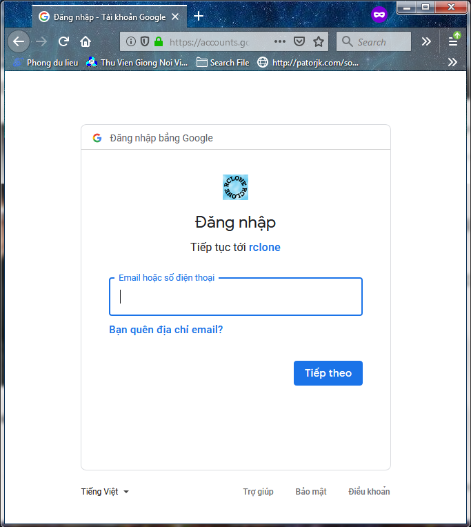
- Bước 8: Nếu không quan tâm về team drive thì chọn `n`
	```
	Configure this as a team drive?
	y) Yes
	n) No
	y/n> n
	```
- Bước 9: Chọn `y` để lưu lại tất cả cấu hình.
	```
	--------------------
	[remote]
	client_id = 
	client_secret = 
	scope = drive
	root_folder_id = 
	service_account_file =
	token = {"access_token":"XXX","token_type":"Bearer","refresh_token":"XXX","expiry":"2014-03-16T13:57:58.955387075Z"}
	--------------------
	y) Yes this is OK
	e) Edit this remote
	d) Delete this remote
	y/e/d> y
	```
### 2. Tự tạo Google App.
- Bước 1: Vào link sau: [https://console.developers.google.com/](https://console.developers.google.com/). Nếu chưa đăng nhập thì đăng nhập đi nhé.
- Bước 2: Bấm nút `Create Project` và nhập tên muốn tạo trong ô `Project name`.<br>
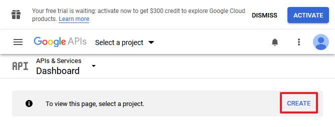
- Bước 2.1: Cuối cùng nhấn nút `create`.<br>
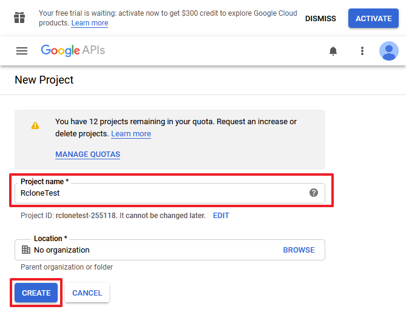
- Bước 3: Bấm ***ENABLE APIS AND SERVICE***.
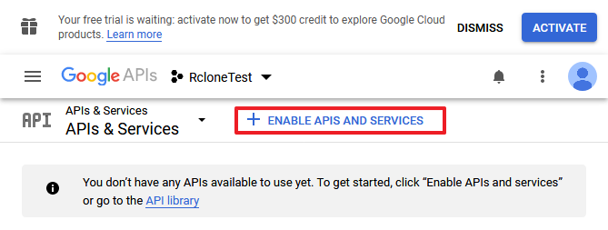
- Bước 4: Tìm kiếm ***Google drive***.<br>
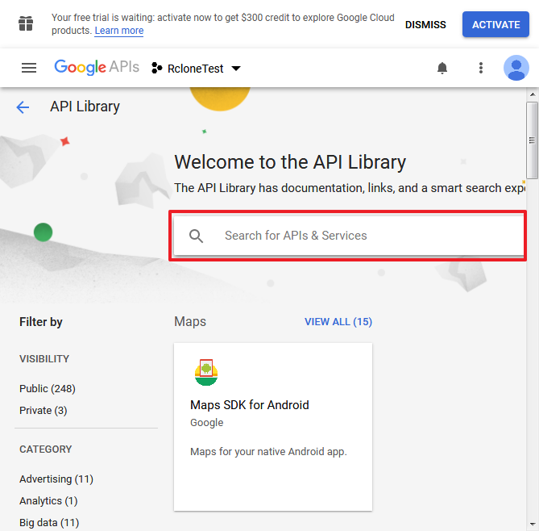
- Bước 4.1: Chọn Google Drive API<br>
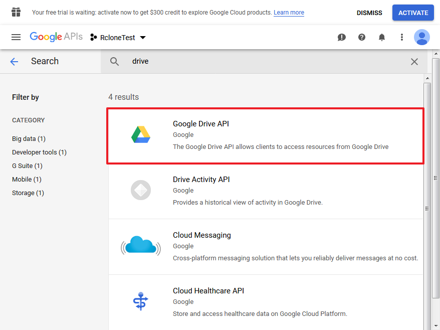
- Bước 5: Bật nó lên.<br>
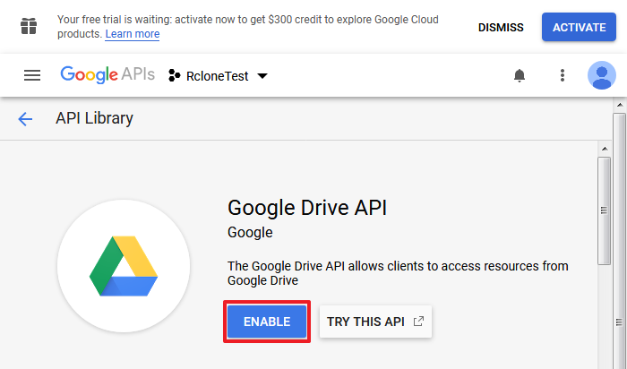
- Bước 6: Tạo chứng chỉ.<br>
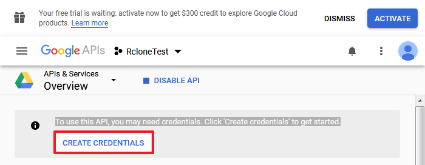
<br>Nhấn nút `Cancel`<br>
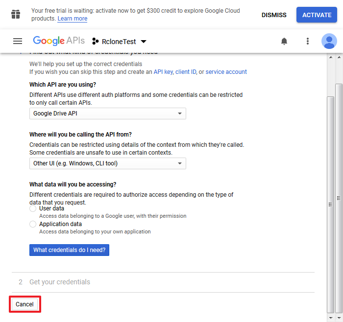
- Bước 7: Chọn ***OAuth client ID***.<br>
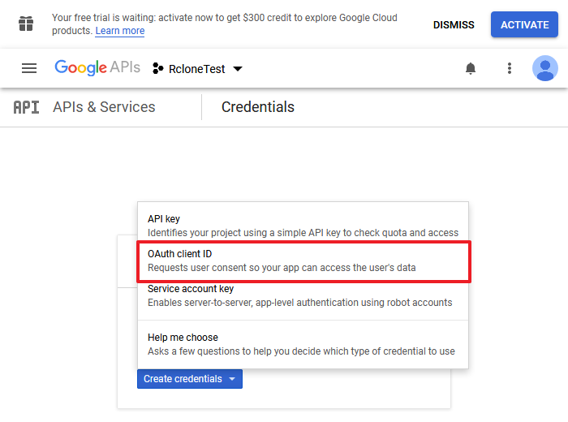
<br>Nhấn nút `Configure consent screen`<br>
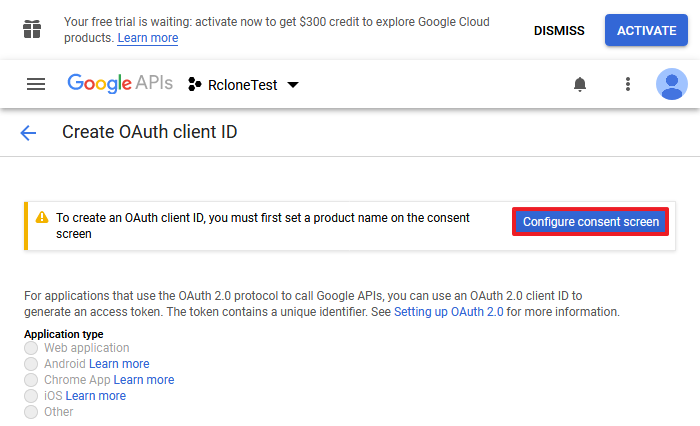
- Bước 8: Chọn các quyền liên quan đến google drive.<br>
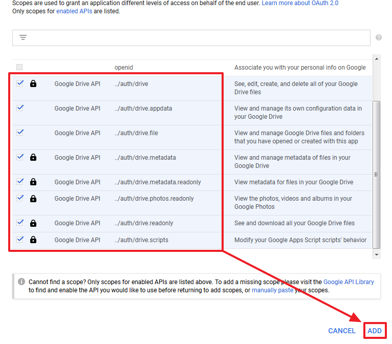
- Bước 9: Đặt tên và bấm nút `Create`.<br>
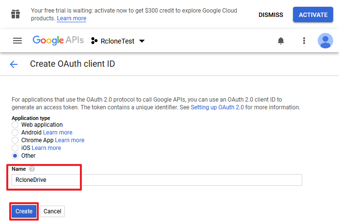
- Bước 10: Sao chép ***Client ID*** và ***Client secret*** và dán vào ***Bước 4*** ở trên kia.<br>
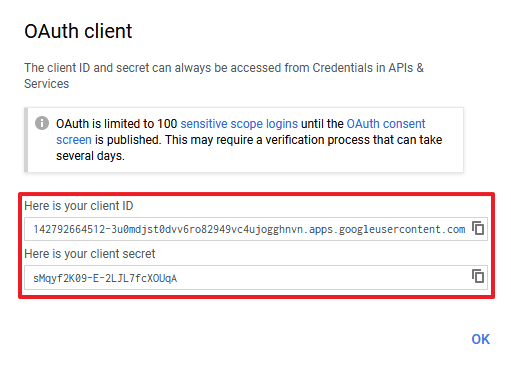
- Bước 11: Hoàn tất các phần cấu hình còn lại.
- Ghi chú: Nếu các bạn gặp trường hợp sau thì làm theo hình nhé.<br>
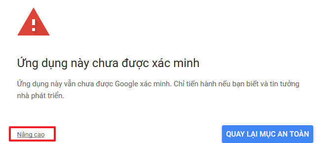
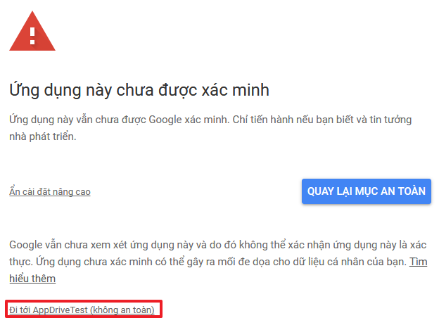
### 3. Một vài lệnh tham khảo.
Ví dụ bạn đã tạo một remote tên là ***gdrive***
- Lệnh config: Ngoài việc tạo cấu hình thì nó cũng sẽ liệt kê các remote hiện có.
	```
	Current remotes:
	
	Name                 Type
	====                 ====
	gdrive 			  drive
	
	e) Edit existing remote
	n) New remote
	d) Delete remote
	r) Rename remote
	c) Copy remote
	s) Set configuration password
	q) Quit config
	e/n/d/r/c/s/q>
	```
- Lệnh copy: 
	``` 
	rlcone -v copy <nguồn> <đích> 
	rclone -v copy d:\video.mp4 gdrive:/ <-- copy tập tin lẻ
	rlcone -v copy gdrive:/video.mp4 d:\
	rclone -v copy d:\youtube\ gdrive:/youtube/ <-- copy cả thư mục
	rclone -v copy gdrive:/youtube/ d:\youtube\
	rclone -v copy gdrive:/youtube/ gdrive:/download/ <-- Với tính năng này thì không cần phải tải về rồi tải lên lại google drive nó được gọi là remote copy. Yêu cầu: phải cùng 1 remote.
	```
-  Lệnh move (dịch chuyển) - tương tự lệnh copy:
	``` 
	rlcone -v move <nguồn> <đích> 
	rclone -v move d:\video.mp4 gdrive:/ <-- copy tập tin lẻ
	rlcone -v move gdrive:/video.mp4 d:\
	rclone -v move d:\youtube\ gdrive:/youtube/ <-- copy cả thư mục
	rclone -v move gdrive:/youtube/ d:\youtube\
	rclone -v move gdrive:/youtube/ gdrive:/download/ <-- Với tính năng này thì không cần phải tải về rồi tải lên lại google drive nó được gọi là remote copy. Yêu cầu: phải cùng 1 remote.
	```
- Để xem thêm lệnh ta có thể gõ `rclone --help` hoặc vào link: [https://rclone.org/commands/](https://rclone.org/commands/)
## III. Nâng cao.
### 1. Biên tập tập tin cấu hình (rclone.conf) của rclone.
- Mặc định tập tin cấu hình sẽ được lưu ở thư mục home của người dùng như sau `.config/rclone/rclone.conf` hoặc nếu biến môi trường `$XDG_CONFIG_HOME` được thiết lập thì nó sẽ lưu tại `$XDG_CONFIG_HOME/rclone/rclone.conf`
- Nếu bạn chạy `rclone config file` nó cũng sẽ chỉ chỗ tập tin cấu hình cho bạn.
- Chúng ta cũng có thể chủ động thiết lập chỗ lưu tập tin cấu hình bằng lệnh:
	```
	rclone --config <đường dẫn đến tập tin cấu hình>
	```
- Tập tin này đơn giản chỉ là tập tin văn bản, bạn có thể mở nó bằng bất cứ trình soạn thảo văn bản đơn giản nào cũng được, ví dụ: notepad, ...
- Nội dung có nó như sau:
	```
	[gdrive]
	type = drive
	client_id = xxx
	client_secret = xxx
	scope = drive
	root_folder_id = root
	service_account_file = 
	token = {"access_token":"xxx","token_type":"Bearer","refresh_token":"xxx","expiry":"2019-10-06T14:00:37.3549344+07:00"}
	team_drive = 
	```
	Với một tập tin như trên bạn có thể sửa trường sau đây: ***root_folder_id***, tên trong dấu ngoặc vuông []. 

	Ví dụ bạn tạo một thư mục mới trên google drive. Bạn muốn có nó trong danh sách remote mới của rclone.

	Bước 1: Ta sao chép y chang nội dung bên trên.

	Bước 2: Lấy ID của thư mục mới trên google drive, ví dụ tạo thư mục ***upload*** với id là `1aq0XiiONdhgtJvTKJlMbS5f8jqJmcEl3`. Ta thay vào chỗ ***root_folder_id*** là được.

	Bước 3: Đổi tên ***gdrive*** trong dấu ngoặc vuông thành bất cứ tên gì mà bạn thích, ví dụ: ***upload_gdrive***.
	Nội dung tập tin mới là:
	```
	[gdrive]
	type = drive
	client_id = xxx
	client_secret = xxx
	scope = drive
	root_folder_id = root
	service_account_file = 
	token = {"access_token":"xxx","token_type":"Bearer","refresh_token":"xxx","expiry":"2019-10-06T14:00:37.3549344+07:00"}
	team_drive = 
	 
	[upload_gdrive]
	type = drive
	client_id = xxx
	client_secret = xxx
	scope = drive
	root_folder_id = 1aq0XiiONdhgtJvTKJlMbS5f8jqJmcEl3
	service_account_file = 
	token = {"access_token":"xxx","token_type":"Bearer","refresh_token":"xxx","expiry":"2019-10-06T14:00:37.3549344+07:00"}
	team_drive = 
	```
	Bạn chạy lênh `rclone config` nó sẽ hiển thị ra như sau:
	```
	Current remotes:
	
	Name                 Type
	====                 ====
	gdrive 			    drive
	upload_gdrive	    drive
	
	e) Edit existing remote
	n) New remote
	d) Delete remote
	r) Rename remote
	c) Copy remote
	s) Set configuration password
	q) Quit config
	e/n/d/r/c/s/q>
	```
- Nhớ cất kĩ tập tin này, ***nếu nó bị lọt vào tay ai đó thì họ sẽ có quyền truy cập vào google drive của bạn*** và họ làm gì xấu thì hậu quả ko thể lường trước được.
### 2. Biến google drive thành một ổ đĩa trên windows (GNU/Linux để sau he he).
- Đơn giản là chúng ta tạo một dịch vụ webdav và liên kết nó với google drive.
- Dùng lệnh: ```rclone -v --addr "IP:PORT" serve webdav <tên remote>```
- Ví dụ: Ta có remote tên là ***gdrive*** và server webdav lắng nghe trên địa chỉ `127.0.01:5000`.
- Bước 1: Chạy lệnh ```rclone -v --addr "127.0.0.1:5000" serve webdav gdrive:/```
- Bước 2: Trên windows ta làm như sau:<br>
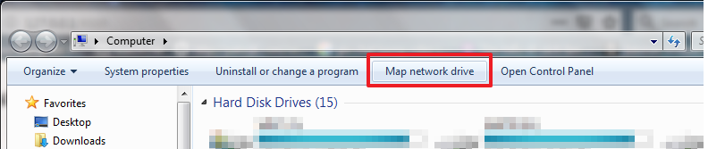
- Bước 3: Nhập uri mà ở bên trên vào ô ***Folder***<br>
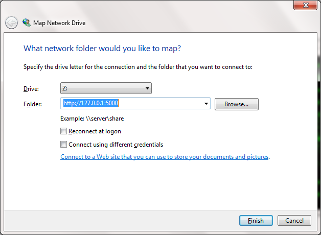
- Bước 4: Kết quả<br>
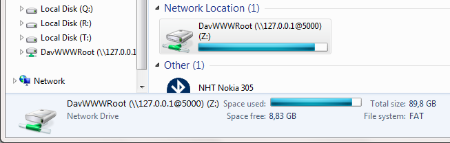
- Bước 5: Nếu không thích dùng nữa thì ngắt kết nối (Disconnect).<br>
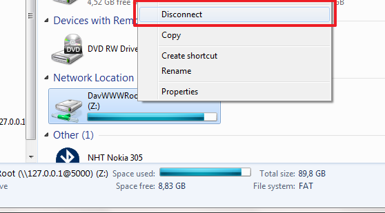
### 3. Mã hóa tập tin và thư mục.
- Bước 1:  Chạy lệnh: ```rclone config```
- Bước 2: Để tạo một remote mới ta chọn n và đặt tên cho nó
	```
	No remotes found - make a new one
	n) New remote
	r) Rename remote
	c) Copy remote
	s) Set configuration password
	q) Quit config
	n/r/c/s/q> n
	name> tên remote mới
	```
- Bước 3: Xem số và chọn số đại diện cho việc mã hóa/giải mã (Encrypt/Decrypt) hoặc gõ `crypt`:
	```
	Type of storage to configure.
	Choose a number from below, or type in your own value
	...
	XX / Encrypt/Decrypt a remote
	   \ "crypt"
	...
	Storage> crypt
	```
- Bước 4: Khai báo remote kèm đường dẫn đến thư mục cần mã hóa/giải mã. Ví dụ: Bạn có remote: ***gdrive*** với thư mục ***crypt***
	```
	Remote to encrypt/decrypt.
	Normally should contain a ':' and a path, eg "myremote:path/to/dir",
	"myremote:bucket" or maybe "myremote:" (not recommended).
	remote>gdrive:/crypt <--- khai báo remote kèm đường dẫn. 
	```
- Bước 5: Lựa chọn việc mã hóa tên tập tin hay không. Thông thường chọn tùy chọn `2` hoặc `standard`
	```
	How to encrypt the filenames.
	Choose a number from below, or type in your own value
	 1 / Don't encrypt the file names.  Adds a ".bin" extension only.
	   \ "off"
	 2 / Encrypt the filenames see the docs for the details.
	   \ "standard"
	 3 / Very simple filename obfuscation.
	   \ "obfuscate"
	filename_encryption> standard
	```
- Bước 6: Lựa chọn mã hóa tên thư mục hay không. Ở đây mình chọn không (`false`).
	```
	Option to either encrypt directory names or leave them intact.
	Choose a number from below, or type in your own value
	 1 / Encrypt directory names.
	   \ "true"
	 2 / Don't encrypt directory names, leave them intact.
	   \ "false"
	directory_name_encryption> false
	```
- Bước 7: Tạo mật khẩu.
	```
	Password or pass phrase for encryption.
	y) Yes type in my own password <--- Gõ mật khẩu mà bạn muốn.
	g) Generate random password   <--- Tạo mật khẩu ngẫu nhiên.
	y/g> y
	```
- Bước 8: Tạo mật khẩu để bảo vệ mật khẩu (tăng bảo mật), bỏ trống hoặc gõ `n` để bỏ qua.
	```
	Password or pass phrase for salt. Optional but recommended.
	Should be different to the previous password.
	y) Yes type in my own password
	g) Generate random password
	n) No leave this optional password blank
	y/g/n> n
	```
- Bước 9: Gõ `y` để lưu lại cấu hình
	```
	Remote config
	--------------------
	[crypt_gdrive]
	type = crypt
	remote = gdrive:/crypt
	filename_encryption = standard
	directory_name_encryption = false
	password = *** ENCRYPTED ***
	password2 =
	--------------------
	y) Yes this is OK
	e) Edit this remote
	d) Delete this remote
	y/e/d> y
	```
	Sau khi tạo xong thay vì thao tác với ***gdrive*** cũ thì bạn sẽ dùng remote mới là ***crypt_gdrive***.
 
	Ví dụ: `rclone -v copy d:\upload\ crypt_gdrive:/ `
	
	Lúc này các tập tin mã hóa sẽ lưu ở thư mục ***gdrive:/crypt*** ở trên google drive.

	À, để liệt kê thông tin các tập tin mã hóa bạn dùng lệnh: `rclone -v ls <tên remote mã hóa>`. Ví dụ: `rclone -v ls crypt_gdrive:/`

## IV. Một vài mẹo.
#### 1. Bạn lo xa ngày nào đó lỡ như rclone không truy cập được google drive hoặc tệ hơn là nó không hỗ trợ nữa, lúc này bạn lo lắng không biết làm sao với các tập tin mã hóa đã lưu trên đó.
#### Bạn sẽ làm như sau:
- Tải các tập tin về lưu vào một thư mục nào đó.
- Biên tập lại tập tin cấu hình (rclone.conf) như sau. Ví dụ bạn lưu các tập tin trên ở thư mục ***d:\download_crypt***.
	```
	[crypt_gdrive]  <--- Thông tin cấu hình cũ
	type = crypt
	remote = gdrive:/crypt
	filename_encryption = standard
	directory_name_encryption = false
	password = *** ENCRYPTED ***
	password2 =

	[download_crypt]  <--- Sao chép và sửa đổi lại mới
	type = crypt	
	remote = d:\download_crypt <--- Thay tên remote thành thư mục chứa tập tin mã hóa.
	filename_encryption = standard
	directory_name_encryption = false
	password = *** ENCRYPTED ***
	password2 =
	```
- Bạn dùng lệnh: `rclone -v ls download_crypt:/` để liệt kê thông tin các tập tin mã hóa.
- Cuối cùng bạn dùng lệnh: `rclone -v copy download_crypt:/ d:\decrypt` để giải mã các tập tin trên.
#### 2. Tạo ổ đĩa mã hóa bằng cách kết hợp webdav và remote mã hóa.
- Bằng cách kết hợp mục III. 2 và III. 3 với nhau ta sẽ có được 1 ổ đĩa mã hóa. Ta sẽ có chuỗi sau: `Ổ đĩa webdav <-> remote mã hóa <-> google drive`.
- Ví dụ: bạn có remote mã hóa là ***crypt_gdrive***.
- Lúc này ta sẽ chạy lệnh `rclone -v --addr "127.0.0.1:5000" serve webdav crypt_gdrive:/`. Sau đó làm tương tự như ở mục III. 2 kể từ bước 2 trở đi.
- Quá trình thao tác đọc/ghi với tập tin ở ổ đĩa trên trông giống một ổ đĩa thông thường, nhưng nó khác ở chỗ trên google drive các tập tin này đều bị mã hóa. Quá trình này không tạo ra tập tin trên ổ cứng trong quá trình thao tác với tập tin. Thông thường khi bạn mã hóa/giải mã tập tin, bạn phải mã hóa/giải mã ra ổ cứng rồi mới đọc/ghi tập tin mới đó. Nhưng ở đây rclone không làm thế, thay vì ổ cứng nó sẽ dùng RAM để làm việc này, có một thuật ngữ chỉ quá trình này gọi là on-the-fly. Bạn yên tâm với tập tin dung lượng lớn thì nó sẽ chia thành đoạn nhỏ để thao tác, do đó sẽ không ăn nhiều RAM đâu.
- Bạn còn có thể tạo một chuỗi sau: `Ổ đĩa webdav <-> remote mã hóa <-> remote cache <-> google drive`. Trong đó `remote cache` sẽ giúp đệm dữ liệu (lưu trữ tại ổ cứng) đã mã hóa/giải mã rồi mới gửi lên google drive. Các bạn có thể tham khảo [tại đây](https://rclone.org/cache/) để tạo một remote cache.
