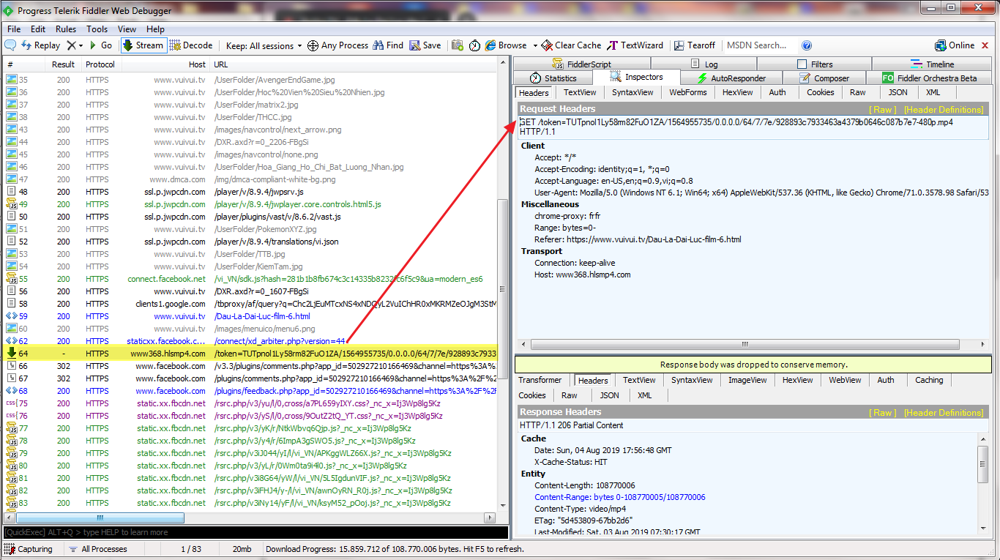
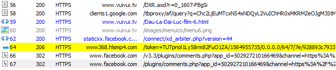

# vuivui.tv đã giấu link video của họ như thế nào?

## Giới thiệu
Vào một ngày đẹp trời lên xem phim Đấu la đại lục trên vuivui.tv thì thấy chất lượng phim chỉ còn 480p, muốn xem chất lượng cao hơn thì phải bỏ tí tiền ra. Lúc đó cũng nổi máu cố tìm xem thử có link HD không thì kết quả **THẤT BẠI**.

## Quá trình
Sau đây là quá trình tìm kiếm và cũng có khám phá ra một kĩ thuật mình đặt tên là: ***Tạo lỗi để khám phá code*** he he.

* Đầu tiên mở **Chrome** và **Fiddler**. Trên chrome gõ CTRL+SHIFT+N (tab ẩn danh) + bật devtool bằng F12 sau đó mới nhập link: https://www.vuivui.tv/Dau-La-Dai-Luc-film-6.html (cái này tùy ý), mục đích là tránh trình duyệt lấy lại dữ liệu từ cache thay vì từ mạng.
* Lúc này trên Fiddler hiện ra danh sách các url, tìm url chứa link video.

* Sau khi tìm được link video, chúng ta tiếp tục xem link video xuất phát từ đâu. 

 Kết quả ta được 

 Nhưng nó không đúng, do lúc tìm kiếm ta chọn ở cả *Requests and responses*. Để tránh tình trạng này thì chỉ cần chọn *Responses Only* là đủ.
* Sau khi tìm theo cách trên mà không được kết quả gì thì có vẻ link video được gọi từ mã js.
* Vào devtool > tab network, chúng ta tìm xem link video kia xuất phát từ đâu. 

* Thông thường ở cột Initiator sẽ hiện ra nơi gọi url mà ở đây lại không có => **Bí** *(Bắt đầu suy nghĩ các thứ)* => Có vẻ như nó phải nằm đâu đó trong 1 đoạn mã js nào đó rồi.
* Lúc này mình mới nghĩ: ***Thử tạo request lỗi xem thằng js nó có bung cái lỗi nào ra không*** rồi xử lý tiếp.
* Với ý nghĩ trên, mình vào Fiddler > tab AutoResponder.

* Sau khi thêm url trên vào, chỉnh sửa lại một chút ở Rule Editor: _regex:(?inx)^https://www.*.hlsmp4.com/.*.mp4_
* Kiểm tra xem đã khớp với mẫu chưa.

* Ở ô dưới cùng chọn lỗi trả về là 404 với tập tin mẫu là: *404_Plain.dat*. Cái này tùy ý có thể trả mã 502 cũng được.

* Sau đó, làm lại các bước từ đầu tới giờ, nhưng ta vào lại devtool > tab console và xem lỗi có bung ra không. Bắt đầu quá trình tìm kiếm...
* May mắn là có một lỗi do thằng JW Player bung ra *MediaError*. Mở xem chi tiết lỗi này ta sẽ thấy Call stack, một dãy các hàm gọi liên tiếp nhau bắt đầu từ thằng *get-episodes...*.

 Call stack 

* Nhấp vào dòng đầu tiên dẫn ta đến một đoạn js bị làm rối mã, thôi tạm bỏ qua vậy.

* Nhấp dòng thứ 2, ồ mọi thứ đây rồi. 

* Quay lại phân tích mã js đầu tiên. Ta thấy có 2 dòng lệnh eval, mà eval là dùng để thực thi code js từ dạng chuỗi. Copy đoạn code trên bỏ đi 2 thằng eval, lưu vô file, gọi thằng nodejs lên chạy thì ta được đoạn mã ở dòng 2.
Lưu vào file

 Kết quả sau khi chạy với nodejs 

## Tóm lại
* Trước tiên tìm kiếm trong fiddler trước.
* Nếu không có quay sang tab network của devtool.
* Cuối cùng tạo lỗi để mò ra code.

### Hi vọng mọi người xem bài này thì cũng có thể may mắn tìm được thứ mình muốn với kĩ thuật này.

