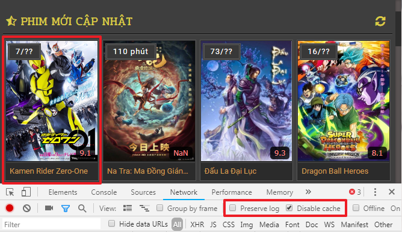
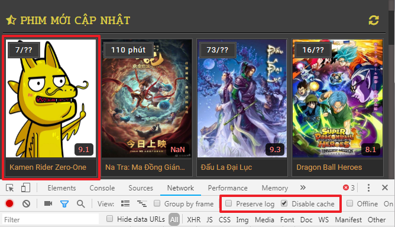
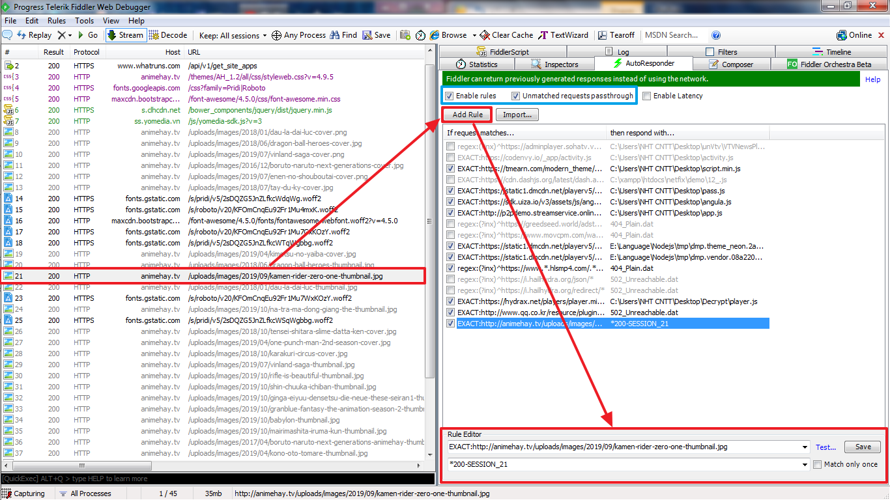
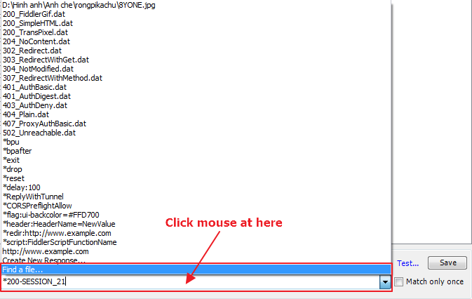
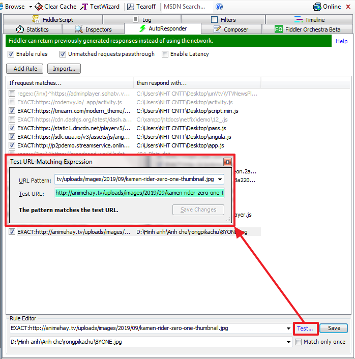

## Thay đổi nội dung http response với Fiddler.

### Để dễ hiểu thì có ví dụ như như hình dưới:  
 
 
### Vậy để làm như trên thì ta phải làm như thế nào ? 
- Đầu tiên, chuyển qua thẻ ***AutoResponder***, tích vào 2 ô ***Enable rules*** và ***Unmatched requests passthrough***.
- Bước 1: Chọn URL cần thay đổi http response, bấm nút ***Add Rule***. Trong ô đầu tiên của ***Rule Editor*** bạn thay đổi cho phù hợp để khớp với URL, có hỗ trợ cả regex nữa. 
 
- Bước 2: Click vào ô thứ 2 của ***Rule Editor***, bạn sẽ thấy nhiều tùy chọn mẫu có sẵn. Ngoài ra bạn cũng có thể chỉ định tập tin mà bạn muốn, chọn dòng ***Find a file...***, sau đó chọn tập tin mà bạn muốn. 
 
- Bước 3: Sau tất cả bạn chọn nút ***Test...*** để kiểm tra có khớp với URL mà bạn chọn hay không, nếu màu xanh là OK, màu đỏ là sai rồi nhá. Rồi bấm nút ***Save*** là xong. 

### Mục đích:
- Bạn đang debug một tập tin js trong tab ***Sources*** của ***dev tool chrome***. Nhưng thông thường tập tin này sẽ bị lượt bớt/nén (minify/compress), tuy chrome có tính năng làm đẹp code nhưng nếu code lớn thì bạn chắc hẳn gặp trường hợp dev tool đơ cmn luôn. Để giải quyết trường hợp này, ta làm đẹp code sau đó lưu vào đâu đó trên đĩa cứng, sau đó dùng tính năng trên của fiddler để thay code cũ thành code mới (đẹp hơn), bạn sẽ không còn gặp trường hợp bị đơ hay lag nữa.
- Gặp trường hợp bị chống debug js, trong code js có dòng `debugger`. Bạn cũng có thể dùng tính năng trên để loại bỏ nó.
