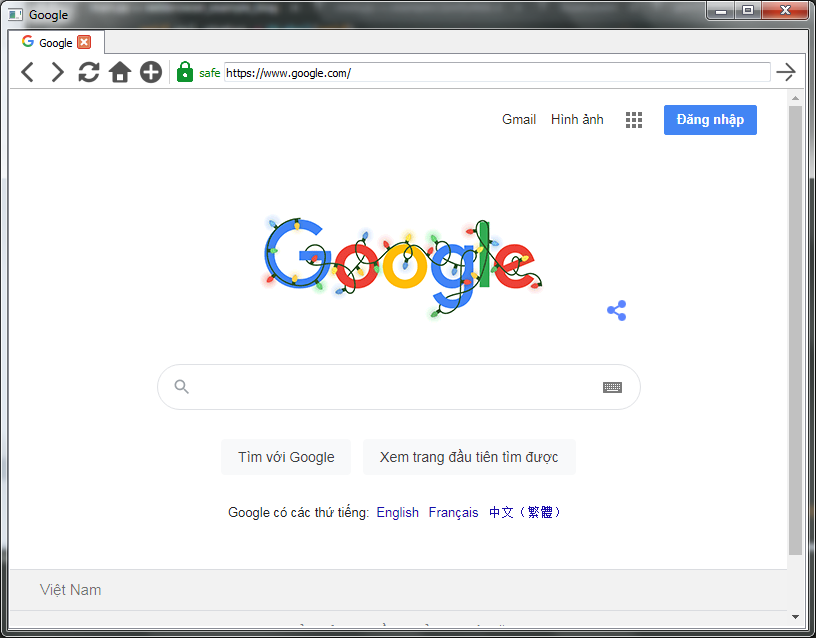
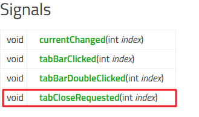
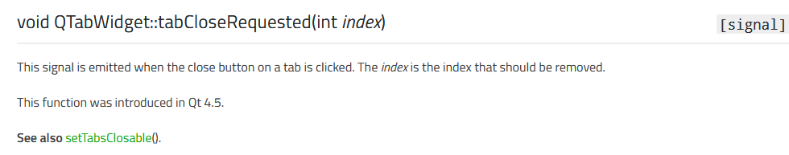
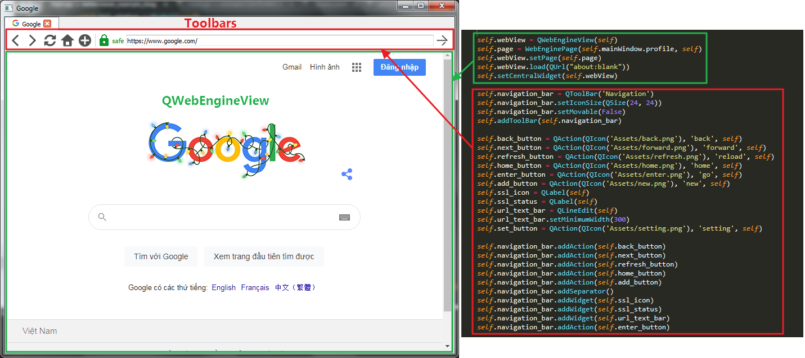

## Giới thiệu
Hôm nay chúng ta sẽ cùng tạo 1 con trình duyệt web cơ bản.

Em nó được viết bằng python dựa trên nền Qt5 và QtWebEngine. Mà QtWebEngine thì dựa trên nền Chromium nên nó hơi hao hao giống chrome :)

Mục đích tạo ra nó là để học hỏi và làm một vài thứ hay ho khác, các bài viết sau sẽ rõ :).

Link code [mini web browser](https://github.com/NguyenKhong/miniwebbrowserqt)

Đây là hình ảnh của em nó.



## Lập trình
### Nguyên liệu:
1. Python3
2. PyQt5
3. PyQtWebEngine
4. Text Editor hoặc IDE tùy ý nhá.
### Cài đặt.
Python3 dễ cài quá mà.

Với Qt thì dùng lệnh pip. Cụ thể:
```
pip install PyQt5 PyQtWebEngine
```

### Code
Code của em nó sẽ ở cuối bài hoặc đâu đó trong bài viết này :).

#### Code cửa sổ chính
Sau đây là code phần cửa sổ chính.
```
class MainWindow(QMainWindow):
    """docstring for MainWindow"""
    def __init__(self, *args, **kwargs):
        super(MainWindow, self).__init__(*args, **kwargs)
        self.tabs = QTabWidget(tabsClosable=True, movable=True)
        self.tabs.setTabShape(0)
        self.resize(800, 600)
        # self.showMaximized()
        self.setCentralWidget(self.tabs) # Đặt tab là Central Widget 
        self.tabs.tabCloseRequested.connect(self.CloseCurrentTab)
        self.tabs.currentChanged.connect(lambda i: self.setWindowTitle(self.tabs.tabText(i)))
        self.profile = WebProfile(self) # Tạo profile cho trình duyệt
        self.init_tab = BrowserTab(self) # Tạo tab mới mặc định khi mở trình duyệt
        self.init_tab.webView.load(QUrl("https://www.google.com")) 
        self.AddNewTab(self.init_tab) # Thêm tab mới vào danh sách các tabs

    def AddNewTab(self, tab):
        i = self.tabs.addTab(tab, "")
        tab.setTabIndex(i)
        self.tabs.setCurrentIndex(i)
        self.tabs.setTabIcon(i,QIcon('Assets/main.png'))
        
    def CloseCurrentTab(self, tabIndex):
        if self.tabs.count() > 1:
            self.tabs.widget(tabIndex).close()
            self.tabs.removeTab(tabIndex)
        else:
            self.close()
```

Như ae thấy code phía trên. Chúng ta kế thừa lại lớp QMainWindow của qt. 

Trong Qt QMainWindow sẽ có bố cục như sau.


Nguồn: [https://doc.qt.io/archives/qt-5.8/qmainwindow.html](https://doc.qt.io/archives/qt-5.8/qmainwindow.html)

Cơ bản cửa sổ chính của chúng ta sẽ có các thành phần sau: Menu Bar, Toolbars, Dock Widgets, Centeral Widget và Status Bar.

Nhìn vào code trên ta thấy `self.tabs = QTabWidget(tabsClosable=True, movable=True) ` và `self.setCentralWidget(self.tabs)` trong hàm `__init__` sẽ tạo ra 1 thanh tabs (nhìn hình đầu), và thêm nó vào vị trí Central Widget.

Tiếp theo trong code ta sẽ thấy
```
self.tabs.tabCloseRequested.connect(self.CloseCurrentTab)
self.tabs.currentChanged.connect(lambda i: self.setWindowTitle(self.tabs.tabText(i)))
```

Phần code trên là code sự kiện diễn liên quan đến các tabs, như là đóng tab hoặc thay đổi giữa các tab. Tương ứng với chúng sẽ là hàm lắng nghe sự kiện này.

Vậy làm thế nào để biết các phương thức, sự kiện, thuộc tính trên. Muốn biết thì phải tra tài liệu (document) của qt thôi.

Như phần trên chúng ta đang làm về Qt tab thì chúng ta có thể google: **QTabWidget Qt**. Ta sẽ được link [https://doc.qt.io/qt-5/qtabwidget.html](https://doc.qt.io/qt-5/qtabwidget.html). Tiếp theo chúng ta tìm sự kiện đóng tab chẳng hạn, tìm phần **Signal**, trong Qt signal là sự kiện.



Click vào phần **tabCloseRequested**. Chúng ta sẽ đến phần mô tả sự kiện này.



Vì Qt viết bằng C++ nên hướng dẫn cũng bằng C++ nốt. Công việc của ta là chuyển sang mã python. Cũng dễ thôi.

Để chuyển chúng ta làm như sau: tên signal + .connect(tên hàm xử lý) và cuối cùng là viết hàm với tham số giống tham số có trong mô tả.

Ví dụ: chúng ta viết xử lý sự kiện đóng tab.
```
tabCloseRequested.connect(CloseCurrentTab)

def CloseCurrentTab(index):
    print ("Đóng tab")

```

Đó đơn giản chỉ vậy thôi.

#### Code nội dung tab
Với đoạn code trên sẽ tạo ra khung cửa sổ chính. Để thêm nội dung vào từng tab thì chúng ta có code sau.
```
class BrowserTab(QMainWindow):
    def __init__(self, parent):
        super(BrowserTab, self).__init__(parent)
        self._tabIndex = -1
        self.mainWindow = self.parent()

        self.webView = QWebEngineView(self)
        self.page = QWebEnginePage(self.mainWindow.profile, self)
        self.webView.setPage(self.page)
        self.webView.load(QUrl("about:blank"))
        self.setCentralWidget(self.webView)

        self.navigation_bar = QToolBar('Navigation')
        self.navigation_bar.setIconSize(QSize(24, 24))
        self.navigation_bar.setMovable(False)
        self.addToolBar(self.navigation_bar)

        self.back_button = QAction(QIcon('Assets/back.png'), 'back', self)
        self.next_button = QAction(QIcon('Assets/forward.png'), 'forward', self)
        self.refresh_button = QAction(QIcon('Assets/refresh.png'), 'reload', self)
        self.home_button = QAction(QIcon('Assets/home.png'), 'home', self)
        self.enter_button = QAction(QIcon('Assets/enter.png'), 'go', self)
        self.add_button = QAction(QIcon('Assets/new.png'), 'new', self)
        self.ssl_icon = QLabel(self)
        self.ssl_status = QLabel(self)
        self.url_text_bar = QLineEdit(self)
        self.url_text_bar.setMinimumWidth(300)
        self.set_button = QAction(QIcon('Assets/setting.png'), 'setting', self)

        self.navigation_bar.addAction(self.back_button)
        self.navigation_bar.addAction(self.next_button)
        self.navigation_bar.addAction(self.refresh_button)
        self.navigation_bar.addAction(self.home_button)
        self.navigation_bar.addAction(self.add_button)
        self.navigation_bar.addSeparator()
        self.navigation_bar.addWidget(self.ssl_icon)
        self.navigation_bar.addWidget(self.ssl_status)
        self.navigation_bar.addWidget(self.url_text_bar)
        self.navigation_bar.addAction(self.enter_button)

        self.trigger()
        self.IsLoading = False
```

Code trên là tạo giao diện cho từng tab. Dựa trên bố cục của QMainWindow chúng ta sẽ có các thành phần sau.



Trong phần chúng ta chú ý đến 2 thành phần đó là QWebEngineView và QWebEnginePage.

 * QWebEnginePage nắm giữ HTML, lịch sử duyệt web, profile và thực thi các [hành động](https://doc.qt.io/qt-5/qwebenginepage.html#WebAction-enum) như reload, forward, back, ... Nó thực hiện render nội dung web và chạy mã javascripts. 

* QWebEngineView là thành phần chính của module Qt WebEngine. Nó sẽ hiện thị nội dung web sau khi WebEnginePage render xong.

* QWebEngineView và QWebEnginePage có quan hệ 1:1.

Để các tab có cùng một profile giống nhau thì chúng ta phải tạo WebEnginePage với profile đã có từ trước sau đó mới thêm vào QWebEngineView tương ứng.

#### Code trình duyệt ẩn danh và thay đổi User Agent
Để làm điều này chúng ta viết lại lớp QWebEngineProfile
```
class WebProfile(QWebEngineProfile):
    def __init__(self, *args, **kwargs):
        super(WebProfile, self).__init__(*args, **kwargs)
        self.setHttpUserAgent("Mozilla/5.0 (Windows NT 6.1; Win64; x64; rv:77.0) Gecko/20100101 Firefox/77.0")
        self.setPersistentCookiesPolicy(0)
```

Chúng ta chỉ cần đặt lại chính sách cho cookie là xong. Danh sách các chính sách: [https://doc.qt.io/qt-5/qwebengineprofile.html#PersistentCookiesPolicy-enum](https://doc.qt.io/qt-5/qwebengineprofile.html#PersistentCookiesPolicy-enum)

Trong lớp QWebEngineProfile còn nhiều tùy chọn như thiết lập đường dẫn cache, dung lượng cache, ... Vui lòng tham khảo link: [https://doc.qt.io/qt-5/qwebengineprofile.html](https://doc.qt.io/qt-5/qwebengineprofile.html)

Để xóa cache và mọi thứ liên quan trên windows tìm thư mục **QtWebEngine** hoặc theo đường đẫn: %localappdata%\python\.

## HẾT